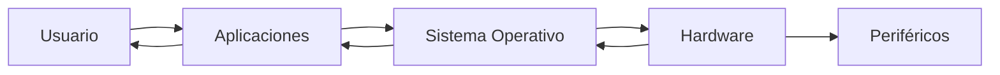
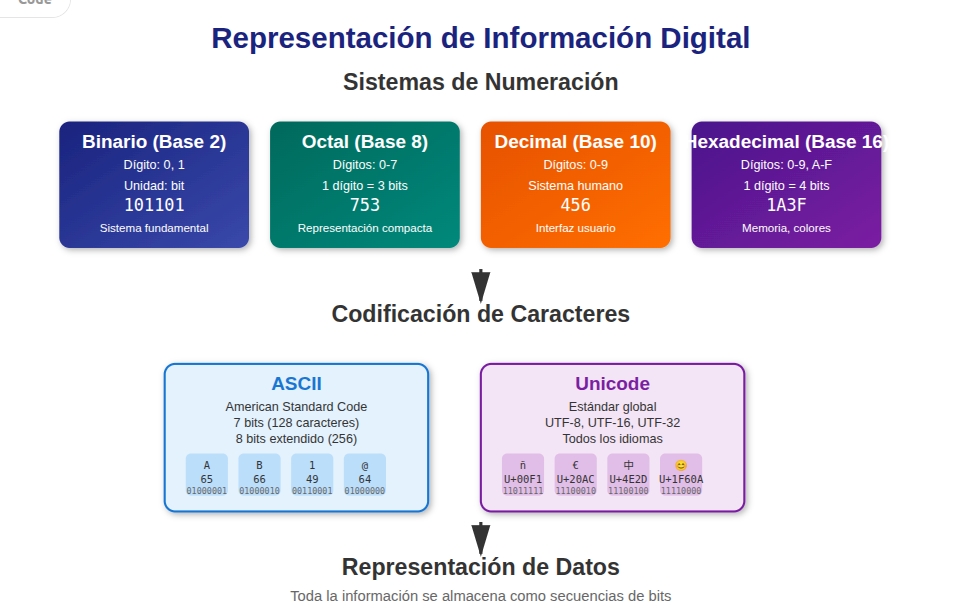
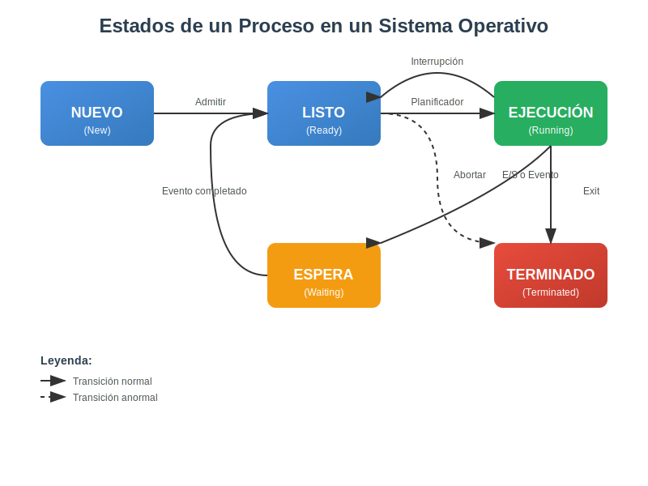

   T1 - Fundamentos de los Sistemas Operativos

Este tema introduce los conceptos fundamentales de los **sistemas operativos (SO)**, aplicables a cualquier entorno, ya sea Windows, Linux, macOS, o incluso en el ámbito de la virtualización. Comprender estos pilares es crucial para cualquier profesional de la informática, ya que son la base sobre la que se construyen y ejecutan todos los programas y aplicaciones.

## 1. Elementos Funcionales de un Sistema Informático

Un sistema informático es una combinación de componentes que trabajan juntos para procesar información. Podemos dividirlos en dos grandes categorías principales: **Hardware** y **Software**.

- **Hardware:** Se refiere a la parte física y tangible de un sistema informático. Es todo lo que puedes tocar. Incluye:
    - **Unidad Central de Procesamiento (CPU):** Es el "cerebro" del ordenador, encargado de ejecutar las instrucciones de los programas. Su rendimiento se mide en GHz y en la cantidad de núcleos.
    - **Memoria RAM (Random Access Memory):** Un tipo de almacenamiento temporal y volátil que guarda los datos y programas que se están usando activamente. Cuanta más RAM, más tareas puede manejar el sistema simultáneamente y con mayor fluidez. La información en RAM se pierde al apagar el equipo.
    - **Dispositivos de Almacenamiento:** Donde se guardan los datos de forma persistente, incluso cuando el equipo está apagado.
        - **Discos Duros (HDD):** Almacenamiento mecánico, más lento pero más económico y con mayor capacidad.
        - **Unidades de Estado Sólido (SSD):** Almacenamiento basado en memoria flash, mucho más rápidos y resistentes, pero más caros.
        - **Memorias USB, Tarjetas SD:** Dispositivos de almacenamiento externo y portátil.
    - **Periféricos de Entrada:** Permiten introducir información al sistema. 
    - **Periféricos de Salida:** Muestran información del sistema al usuario. 
    - **Periféricos de Entrada/Salida (E/S):** Realizan ambas funciones. 
- **Software:** Es la parte lógica e intangible del sistema, compuesta por programas, datos e instrucciones. Es lo que le dice al hardware qué hacer. Se subdivide en:
    - **Sistema Operativo (SO):** El software principal y más importante. Gestiona los recursos de hardware y proporciona una plataforma para que otros programas funcionen. Actúa como el intermediario entre el usuario/aplicaciones y el hardware. Sin un SO, la mayoría de los ordenadores modernos no podrían funcionar.
    - **Aplicaciones (o Software de Aplicación):** Programas diseñados para realizar tareas específicas para el usuario. Ejemplos: navegadores web (Chrome, Firefox), procesadores de texto (Word, Writer), hojas de cálculo (Excel, Calc), juegos, editores de imágenes (Photoshop, GIMP).
    - **Controladores (Drivers):** Software que permite al sistema operativo comunicarse y controlar un hardware específico (por ejemplo, el driver de una impresora, de la tarjeta gráfica o de la tarjeta de red). Son esenciales para que el hardware funcione correctamente.

La **interacción hardware-software** es fundamental para el funcionamiento de un sistema informático. El software envía instrucciones al hardware, y el hardware las ejecuta y devuelve los resultados. El SO es el director de orquesta que coordina toda esta interacción, asegurándose de que los programas accedan al hardware cuando lo necesiten y de forma ordenada.

/// html | div[style='text-align: center;']

///

## 2. La Arquitectura Von Neumann: El Corazón de los Ordenadores Modernos

Para entender realmente cómo interactúan el hardware y el software en un sistema informático, es crucial conocer la **Arquitectura Von Neumann**. La gran mayoría de los ordenadores actuales, desde tu teléfono móvil hasta los superordenadores, se basan en este diseño propuesto por el matemático y científico **John Von Neumann** en la década de 1940.

La idea central de la arquitectura Von Neumann es que tanto las **instrucciones de los programas como los datos se almacenan en una misma memoria principal**. Antes de esta idea, los ordenadores solían tener memorias separadas para las instrucciones y los datos, lo que limitaba su flexibilidad. Al unificar la memoria, se simplificó el diseño y se permitió que los ordenadores fueran más versátiles.

### 2.1. Componentes Clave de la Arquitectura Von Neumann

La arquitectura Von Neumann se compone de cuatro unidades funcionales principales:

- **Unidad Central de Procesamiento (CPU)**: Ya la hemos mencionado, ¡pero aquí la desglosamos más! Es el cerebro del sistema y se encarga de ejecutar las instrucciones. Dentro de la CPU, encontramos dos subcomponentes esenciales:
    - **Unidad Aritmético-Lógica (UAL o ALU - Arithmetic Logic Unit)**: Es la parte de la CPU que realiza las operaciones matemáticas (sumas, restas, multiplicaciones, divisiones) y las operaciones lógicas (comparaciones, AND, OR, NOT). Piensa en ella como la "calculadora" y el "comparador" del ordenador.
    - **Unidad de Control (UC o CU - Control Unit)**: Es el "director de orquesta" de la CPU. Su función es interpretar las instrucciones de los programas y generar las señales necesarias para controlar todas las demás partes del ordenador. Se encarga de coordinar el flujo de datos, decidir qué operación debe realizar la UAL, y qué datos deben ir a la memoria o a los periféricos. También incluye los **Registros**, que son pequeñas unidades de memoria de muy alta velocidad dentro de la CPU, utilizadas para almacenar temporalmente datos e instrucciones con los que la CPU está trabajando en ese momento.
        - **CP**: Contador de Programa. Contiene la dirección de la siguienate instrucción a ejecutar.
        - **RI**: Registro de Instrucción. Contiene la instrucción actual que se está ejecutando,junto con las direcciones de los operandos.
        - **RDM**: Registro de Dirección de Memoria. Contiene la dirección de memoria a la que hay que acceder.
        - **RIM**: Registro de Intercambio de Memoria. Almacena el contenido que se trae o lleva a la memoria.
        - **RA**: Registro Acumlador. Contiene los resultados intermedios de la UAL.
    
- **Memoria Principal**: Esta es la memoria RAM que ya conoces. En la arquitectura Von Neumann, es aquí donde se almacenan tanto los programas (sus instrucciones) como los datos que estos programas necesitan para funcionar. Es una memoria de acceso rápido, pero volátil.
    - **Direcciones de Memoria**: Cada posición de la memoria tiene una dirección única, como la dirección de una casa. La CPU utiliza estas direcciones para encontrar y acceder a las instrucciones y datos que necesita.

- **Unidad de Entrada/Salida (E/S)**: Esta unidad es la encargada de gestionar la comunicación entre el ordenador y el mundo exterior a través de los periféricos. Por ejemplo, cuando escribes algo en el teclado (entrada) o cuando ves una imagen en la pantalla (salida), la unidad de E/S es la que facilita esa interacción.

- **Buses**: Son los "caminos" o "autopistas" por los que se transmite la información entre todos los componentes del sistema. Podemos distinguir principalmente tres tipos de buses:
    - **Bus de Datos**: Transporta los datos entre la CPU, la memoria y los dispositivos de E/S.
    - **Bus de Direcciones**: Lleva las direcciones de memoria a las que la CPU quiere acceder (leer o escribir).
    - **Bus de Control**: Transporta las señales de control y de estado entre los diferentes componentes, indicando qué operación se va a realizar (por ejemplo, leer, escribir, etc.).

<figure markdown="span">
  {: style="width:70%;margin:auto;display:block"}
  <figcaption>https://somebooks.es/capitulo-1-caracterizacion-de-sistemas-operativos/2/</figcaption>
</figure>

### 2.2. ¿Cómo Funciona? El Ciclo de Instrucción

La Arquitectura Von Neumann permite que la CPU ejecute programas siguiendo un ciclo repetitivo llamado **ciclo de instrucción** o ciclo de máquina. Este ciclo tiene principalmente dos fases que se repiten constantemente:

1.  **Fase de Búsqueda (Fetch)**: La Unidad de Control de la CPU busca (lee) la siguiente instrucción del programa desde la Memoria Principal, usando el Bus de Direcciones para localizarla y el Bus de Datos para traerla.
2.  **Fase de Ejecución (Execute)**: Una vez que la instrucción está en la CPU, la Unidad de Control la interpreta. Si la instrucción implica realizar cálculos o comparaciones, la UAL entra en acción. Si necesita acceder a más datos de la memoria o interactuar con un periférico, la Unidad de Control coordina esas acciones. Finalmente, el resultado se guarda en la memoria o se envía a un periférico.

[Ejecución Instrucción](https://gvaedu-my.sharepoint.com/:p:/r/personal/l_garciabonifaz_edu_gva_es/Documents/Clases/SOM/Temas/Tema_01/EjecucionInstruccion.pptx?d=w902c4cc1814449d4affc5de44b7f4f7e&csf=1&web=1&e=lyoGkx){target="_blank"}

## 3. Sistemas de Representación de la Información

Los ordenadores, a diferencia de los humanos, solo entienden y procesan información en un formato binario.

- **Sistemas de Numeración:**

    - **Binario (Base 2):** Es el sistema fundamental para los ordenadores. Solo utiliza dos dígitos: **0** y **1**. Cada dígito binario se conoce como un **bit** (binary digit), la unidad mínima de información. La combinación de bits forma la base de toda la información digital.
    - **Octal (Base 8):** Utiliza los dígitos del 0 al 7. Se usa a veces como una forma más compacta de representar números binarios, ya que un dígito octal equivale a tres bits binarios.
    - **Decimal (Base 10):** Nuestro sistema de numeración habitual, con dígitos del 0 al 9. Es el sistema que usamos para interactuar con los números.
    - **Hexadecimal (Base 16):** Utiliza los dígitos del 0 al 9 y las letras A (10) a la F (15). Es muy común en informática (direcciones de memoria, colores, códigos de error) para representar grandes cantidades de bits de forma concisa, ya que un dígito hexadecimal equivale a cuatro bits binarios (medio byte).

- **Codificación de Caracteres**:

    - Los caracteres (letras, números, símbolos) también deben ser representados como datos binarios para que el ordenador los entienda.

    - **ASCII (American Standard Code for Information Interchange):** Uno de los primeros estándares ampliamente adoptados para representar caracteres. Originalmente usaba 7 bits (128 caracteres), y luego 8 bits (256 caracteres), limitando la representación a caracteres latinos básicos.
    - **Unicode:** Un estándar mucho más moderno y amplio que busca codificar prácticamente todos los caracteres de todos los idiomas del mundo. Utiliza un número variable de bits por carácter (UTF-8, UTF-16, UTF-32) y ha sustituido a ASCII en la mayoría de las aplicaciones modernas, permitiendo la compatibilidad global de texto.

- **Representación de Datos**:

    - Toda la información en un ordenador, desde un simple texto hasta una compleja imagen o un video, se almacena y procesa como secuencias de bits.
  
    - Por ejemplo, una **imagen digital** es una cuadrícula de píxeles, y cada píxel se representa con una combinación de bits que definen su color y brillo.
    - El **audio** se representa muestreando la onda sonora en puntos discretos y convirtiendo la amplitud de cada muestra en un número binario.
    - El **video** es una secuencia de imágenes (fotogramas) que se muestran rápidamente, combinadas con una pista de audio, todo representado digitalmente.

<figure markdown="span">
  { width=100%}
</figure>

## 4. Conceptos Generales de los Sistemas Operativos

### 4.1. ¿Qué es un Sistema Operativo (SO)?
Un **Sistema Operativo (SO)** es el software principal que gestiona el hardware de un ordenador o dispositivo móvil y permite la ejecución de aplicaciones. Actúa como un intermediario entre el hardware y el usuario, gestionando todos los recursos del sistema, como el procesador, la memoria y los dispositivos de entrada/salida.

### 4.2. Funciones principales de un SO:
1. **Gestión de procesos**: Controla la creación, ejecución y finalización de procesos (programas en ejecución).
2. **Gestión de memoria**: Asigna y libera memoria RAM según las necesidades de los programas.
3. **Gestión de almacenamiento**: Organiza y gestiona el acceso a los archivos en dispositivos de almacenamiento como discos duros y SSDs.
4. **Gestión de dispositivos**: Facilita la comunicación entre el hardware y los programas, permitiendo que dispositivos como impresoras o tarjetas gráficas funcionen correctamente.
5. **Interfaz de usuario**: Permite que los usuarios interactúen con el sistema mediante una **Interfaz gráfica de usuario (GUI)** o una **Interfaz de línea de comandos (CLI)**.
6. **Seguridad y control de acceso**: Protege el sistema contra accesos no autorizados y garantiza la integridad de los datos.

### 4.3. Classificación de los S.O. ##

Por número de usuarios:

- **Monousuario**: Un único usuario en el ordenador en un momento dado.
- **Multiusuario**: Varios usuarios en el ordenador.
  
Por número de procesos:

- **Monotasca**: Solo procesa una tarea en un instante dado.
- **Multitasca**: Varias tareas simultáneamente

Por tipo de Licencia:

- **Propietario**: Licencia de código cerrado. Ejemplo: Microsoft Windows.
- **Libre**: Licencia de código abierto. Ejemplo: Ubuntu.

## 5. Procesos y sus Estados

Un **proceso** es la piedra angular de la ejecución de software en un sistema operativo. Es una instancia de un programa en ejecución. Cuando abres una aplicación (por ejemplo, tu navegador web), el sistema operativo crea uno o más procesos para que funcione.

- **Concepto de Proceso y Programa:**
    - Un **programa** es un conjunto de instrucciones estáticas y datos almacenados en el disco duro (un archivo `.exe` en Windows o un binario en Linux). Es una entidad pasiva.
    - Un **proceso** es la ejecución activa de ese programa. Incluye el código del programa, sus datos, su pila de ejecución, sus registros de CPU y su estado actual. Una misma aplicación puede tener varias instancias de proceso ejecutándose simultáneamente (por ejemplo, si abres dos ventanas de tu navegador web, cada una podría ser un proceso separado o un hilo de un mismo proceso principal).
- **Estados de un Proceso:** Un proceso no está siempre ejecutándose. Puede pasar por diferentes estados durante su ciclo de vida, gestionados por el planificador del sistema operativo:
    1. **Nuevo (New/Created):** El proceso acaba de ser creado. El sistema operativo lo está inicializando (asignando recursos como memoria).
    2. **Listo (Ready):** El proceso está cargado en memoria y esperando ser asignado a un procesador para ejecutarse. Está listo para usar la CPU en cuanto esté disponible.
    3. **Ejecución (Running):** El procesador está ejecutando las instrucciones del proceso. En un sistema de un solo núcleo, solo un proceso puede estar en este estado a la vez. En sistemas multinúcleo, puede haber tantos procesos en ejecución como núcleos disponibles.
    4. **Bloqueado/En espera (Blocked/Waiting):** El proceso está esperando que ocurra algún evento externo para poder continuar su ejecución. Ejemplos:
        - Esperando una operación de E/S (lectura de un archivo, entrada del usuario por teclado, respuesta de red).
        - Esperando que un recurso esté disponible (por ejemplo, un archivo que está siendo usado por otro proceso).
    5. **Terminado (Terminated/Exit):** El proceso ha completado su ejecución (ha finalizado todas sus instrucciones) o ha sido abortado por el sistema (por un error o por una acción del usuario). El sistema operativo libera sus recursos.
- **Gestión de Procesos:** El sistema operativo es el responsable de gestionar eficientemente todos los procesos que se ejecutan en el sistema. Esto incluye:
    - **Planificación (Scheduling):** Decidir qué proceso se ejecutará a continuación en la CPU y por cuánto tiempo. Los algoritmos de planificación buscan optimizar el uso de la CPU y proporcionar una buena experiencia al usuario (por ejemplo, que las aplicaciones respondan rápidamente). Algunos algoritmos de planificación son:
        - **FIFO (First In, First Out)**: Los procesos se ejecutan en el orden en el que llegan.
        - **Round Robin**: Cada proceso recibe una cantidad de tiempo fija (cuanto de tiempo) para ejecutarse, y luego le cede el control a otro proceso.
        - **Planificación basada en prioridad**: Los procesos con mayor prioridad se ejecutan primero.
    - **Creación y Eliminación:** Iniciar nuevos procesos (cuando abres una aplicación) y terminar los que ya no se necesitan o han fallado.
    - **Sincronización:** Asegurar que los procesos que comparten recursos (como la memoria o archivos) lo hagan de forma ordenada para evitar conflictos y corrupción de datos.
    - **Comunicación entre Procesos (IPC - Inter-Process Communication):** Permitir que los procesos se intercambien información entre sí de forma controlada.

<figure markdown="span">
  { width=900px}
</figure>

## 6. Estructura y Organización del Sistema de Archivos

### 6.1. Sistemas de Archivos

El **sistema de archivos** es el método por el cual el sistema operativo organiza, almacena, nombra y recupera los archivos y directorios (carpetas) en un dispositivo de almacenamiento. Es como el índice de una biblioteca para tus datos.

- **Sistema de Archivos:** Es una estructura lógica que define cómo se guardan los datos en el disco y cómo el sistema operativo accede a ellos. Proporciona una forma jerárquica y organizada de manejar la información, permitiendo a los usuarios y programas encontrar datos de manera eficiente.
- **Tipos de Sistemas de Archivos:** Existen varios tipos, cada uno con sus propias características, optimizaciones y compatibilidades:
    - **FAT (File Allocation Table):** Una familia de sistemas de archivos más antiguos (ej. FAT16, **FAT32**). Son compatibles con casi todos los sistemas operativos, pero tienen limitaciones importantes: tamaño máximo de archivo (4 GB para FAT32) y tamaño máximo de partición. Se usan a menudo en unidades USB o tarjetas SD por su amplia compatibilidad.
    - **NTFS (New Technology File System):** El sistema de archivos predeterminado y más avanzado para **Windows**. Ofrece características clave como:
        - Mayor seguridad (permisos detallados para archivos y carpetas).
        - Soporte para archivos y particiones muy grandes.
        - Compresión y cifrado de archivos.
        - Journaling (para mayor fiabilidad y recuperación de errores).
    - **Ext (Extended File System):** Una familia de sistemas de archivos (ext2, ext3, **ext4**) utilizados comúnmente en **Linux**.
        - **ext4** es el estándar actual en muchas distribuciones de Linux. Es un sistema de archivos con journaling, muy robusto, rápido y escalable.
    - **Otros Sistemas de Archivos Relevantes:**
        - **HFS+ y APFS:** Usados en macOS.
        - **XFS y Btrfs:** Alternativas avanzadas para Linux con características como snapshots y pools de almacenamiento.
        - **exFAT:** Un sistema de archivos de Microsoft diseñado para memorias flash, sin las limitaciones de FAT32 en tamaño de archivo, y con mayor compatibilidad que NTFS en otros SO.

### 6.2. Jerarquía de Directorios y Archivos

Los sistemas de archivos organizan la información en una estructura de árbol, similar a cómo organizas documentos en carpetas dentro de otras carpetas:

  - **Raíz:** El directorio principal, el punto de partida de toda la estructura de archivos. En Windows, cada unidad de disco tiene su propia raíz (ej. `C:\`, `D:\`). En Linux, hay una única raíz (`/`).
  - **Directorios (Carpetas):** Contenedores que organizan archivos y otros subdirectorios. Permiten una organización lógica de la información.
  - **Archivos:** Las unidades básicas de almacenamiento de datos. Un archivo contiene información específica (un documento de texto, una imagen, un programa ejecutable).

### 6.3. Rutas Absolutas y Relativas

- **Ruta Absoluta:** Especifica la ubicación completa y exacta de un archivo o directorio desde la raíz del sistema de archivos. Es única y no depende de la ubicación actual del usuario.
    - Ejemplo en Windows: `C:\Users\Juan\Documents\informe.docx`
    - Ejemplo en Linux: `/home/juan/documentos/informe.pdf`
- **Ruta Relativa:** Especifica la ubicación de un archivo o directorio respecto a la ubicación actual del usuario (el "directorio de trabajo"). Es más corta pero solo funciona desde una posición específica.
    - Ejemplo: Si estás en el directorio `C:\Users\Juan` (Windows), la ruta relativa a `informe.docx` sería `Documents\informe.docx`.
    - Ejemplo: Si estás en `/home/juan` (Linux), la ruta relativa a `informe.pdf` sería `documentos/informe.pdf`.
    - Los puntos `.` y `..` se usan comúnmente: 
        - `.` representa el directorio actual
        - `..` representa el directorio padre.

## 7. Atributos de Archivos y Directorios

Los **atributos** son propiedades especiales o banderas asociadas a archivos y directorios que controlan su comportamiento o indican ciertas características. No son parte del contenido del archivo, sino metadatos sobre el archivo.

- **Propiedades Básicas (comunes a casi todos los sistemas):**
    - **Tamaño:** La cantidad de espacio que ocupa el archivo en el disco, generalmente en bytes, KB, MB, GB. Para directorios, suele ser el tamaño combinado de su contenido.
    - **Fecha de Creación:** La marca de tiempo que indica cuándo se creó por primera vez el archivo o directorio.
    - **Fecha de Modificación:** La marca de tiempo de la última vez que se modificó el contenido del archivo. Para directorios, la última vez que se modificó su contenido (se añadió/eliminó un archivo).
    - **Fecha de Acceso:** La marca de tiempo de la última vez que se leyó o accedió al archivo (por ejemplo, un programa lo abrió para leer su contenido, aunque no lo modificara).
- **Atributos Especiales (ejemplos comunes, pueden variar entre SO):**
    - **Solo Lectura (Read-only):** Impide que el contenido del archivo sea modificado o eliminado por el usuario o por un programa.
    - **Oculto (Hidden):** El archivo o directorio no se muestra por defecto en las vistas del explorador de archivos. Se usa para archivos del sistema o datos que no son de interés directo para el usuario.
    - **Sistema (System):** Indica que es un archivo o directorio crítico para el funcionamiento del sistema operativo. Suelen estar ocultos y protegidos para evitar eliminaciones accidentales.
    - **Archivo (Archive):** Un atributo utilizado por algunos programas de copia de seguridad para indicar si el archivo ha sido modificado desde la última copia de seguridad. Se activa automáticamente cuando el archivo se modifica.
    - **Comprimido (Compressed):** Indica que el archivo o directorio está almacenado de forma comprimida en el disco para ahorrar espacio. El SO lo descomprime automáticamente al acceder a él.
    - **Cifrado (Encrypted):** Indica que el archivo o directorio está cifrado para proteger su contenido de accesos no autorizados. El SO lo descifra automáticamente para el usuario autorizado.

La gestión de atributos se realiza normalmente a través de las propiedades del archivo o directorio en la interfaz gráfica del sistema operativo, o mediante comandos específicos en la línea de comandos (ej. `attrib` en Windows, `chattr` en Linux para atributos extendidos).

## 8. Permisos de Archivos y Directorios

Los **permisos** son reglas fundamentales de seguridad que definen quién puede acceder a un archivo o directorio y qué acciones puede realizar sobre él (leer, escribir, ejecutar). Son vitales para la privacidad y la integridad de los datos en entornos multiusuario.

- **Concepto de Permisos de Acceso:** El sistema operativo utiliza permisos para controlar quién puede interactuar con los archivos y directorios y de qué manera. Esto evita que usuarios no autorizados accedan, modifiquen o eliminen información.

- **Modelos de Permisos:** Aunque la implementación varía entre sistemas operativos (NTFS en Windows, permisos de usuario/grupo/otros en Linux), la idea central es similar: se define el acceso para diferentes "identidades".

    - **Propietario:** Es el usuario que creó el archivo o directorio. Este usuario generalmente tiene el control total sobre los permisos del archivo.
    - **Grupo:** Un conjunto de usuarios que tienen los mismos permisos sobre el archivo/directorio. Esto facilita la administración de permisos para equipos de trabajo.
    - **Otros (Everyone/World):** Cualquier otro usuario del sistema que no es el propietario ni pertenece al grupo asignado. A menudo se le otorgan los permisos más restrictivos.

- **Tipos de Permisos** (acciones que se pueden permitir o denegar):

    - **Lectura (Read - R):**
        - Para **archivos**: Permite ver el contenido del archivo.
        - Para **directorios**: Permite listar los archivos y subdirectorios que contiene.
    - **Escritura (Write - W):**
        - Para **archivos**: Permite modificar el contenido del archivo, guardarlo, o eliminarlo.
        - Para **directorios**: Permite crear, eliminar o renombrar archivos y subdirectorios dentro de ese directorio.
    - **Ejecución (Execute - X):**
        - Para **archivos**: Permite ejecutar el archivo (si es un programa o script).
        - Para **directorios**: Permite "entrar" en el directorio, es decir, acceder a su contenido o a sus subdirectorios.

- **Aplicación y Modificación de Permisos:**

    - En **Windows (NTFS):** Los permisos se gestionan a través de la pestaña "Seguridad" en las propiedades de archivos y carpetas. Se pueden asignar permisos muy detallados a usuarios y grupos específicos. Existe el concepto de "herencia de permisos", donde los archivos y subcarpetas heredan los permisos del directorio padre por defecto.
    - En **Linux (ext4, etc.):** Los permisos se suelen gestionar a través de la línea de comandos con comandos como `chmod` (para cambiar permisos), `chown` (para cambiar propietario) y `chgrp` (para cambiar grupo). Los permisos se representan a menudo de forma numérica (octal), donde R=4, W=2, X=1. Por ejemplo, `755` significa `rwx` para el propietario, `r-x` para el grupo y `r-x` para otros.

## 9. Sistemas Transaccionales y Selección de Sistemas de Archivos

### 9.1 ¿Qué es una transacción? 

¡Piénsalo como comprar en una máquina expendedora! vending machine. Imagina que quieres comprar un refresco. Metes el dinero y pulsas el botón. Pueden pasar dos cosas:

1.  **Todo sale bien:** Metes el dinero, la máquina lo acepta, y te da tu refresco. ¡Éxito!
2.  **Algo falla:** Metes el dinero, pero la máquina se atasca y no te da el refresco. Lo justo es que te devuelva el dinero, ¿verdad?

Una **transacción** en informática es exactamente eso: una serie de pasos que se tratan como **una sola operación**. O se hacen todos los pasos bien, o no se hace ninguno y todo vuelve a como estaba antes. No hay puntos intermedios.

Esto se conoce como las propiedades **ACID**:

- **Atómica:** O todo o nada. Como en la máquina: o tienes tu refresco y la máquina tu dinero, o tú recuperas tu dinero y la máquina se queda con el refresco.
- **Consistente:** La operación deja todo en un estado correcto. No puede ser que te quedes sin dinero Y sin refresco.
- **Aislada (Isolation):** Si dos personas usan la máquina a la vez, la operación de uno no afecta a la del otro. Cada uno hace su compra por separado.
- **Duradera:** Una vez que la máquina te ha dado el refresco, la compra es definitiva. No puede "deshacerse" sola.

### 9.2. El Journaling

¿Y esto qué tiene que ver con los archivos de mi PC?.

Los sistemas de archivos modernos (como los que usan Windows, Linux o macOS) necesitan ser muy fiables. ¿Qué pasa si estás guardando un trabajo importante y de repente se va la luz?. Podrías perderlo todo o, peor aún, el archivo podría quedar "corrupto" e inutilizable.

Para evitar esto, usan una técnica llamada **Journaling** (o "registro por diario").

**¿Cómo funciona el Journaling?**

Piensa en el *journal* como una **libreta de "cosas por hacer"** o un borrador.

1.  **Apuntar en la libreta:** Antes de guardar el archivo de verdad en el disco duro, el sistema operativo escribe en esa libreta especial: "Oye, voy a guardar este archivo en este sitio".
2.  **Hacer el trabajo:** Una vez que lo ha apuntado, empieza a guardar el archivo en su ubicación final.
3.  **Tachar de la lista:** Cuando termina de guardarlo correctamente, vuelve a la libreta y tacha la tarea como "completada".

**¿Cuál es la ventaja de esto?**

Si el ordenador se apaga de golpe mientras está guardando (paso 2), no hay pánico. Al volver a encenderlo, el sistema operativo mira su "libreta" (el *journal*) y ve que había una tarea a medias.

* Si la tarea estaba casi completada, la termina rápidamente.
* Si la tarea acaba de empezar y no es segura, la deshace, dejando todo como estaba antes.

Gracias a esto, tu sistema de archivos siempre está en un estado **consistente y seguro**. Se reduce muchísimo el riesgo de perder datos o tener archivos corruptos por un apagón.

* **Sistemas CON Journaling (más seguros):** **NTFS** (Windows), **ext4** (Linux), **APFS** (macOS).
* **Sistemas SIN Journaling (más antiguos y arriesgados):** **FAT32** (el que usan muchos pendrives antiguos). Es más simple, pero un apagón durante una escritura puede causar un desastre.

### 9.3. Elección del sistema de archivos

No todos los sistemas de archivos son iguales. Al formatear un disco duro, un SSD o un pendrive, tienes que elegir uno. Aquí tienes los factores clave a considerar:

- **Fiabilidad:** ¿Tiene *journaling*? Para el disco de tu sistema operativo o donde guardes cosas importantes, **siempre** querrás uno con journaling.
- **Compatibilidad:** ¿Qué sistema operativo vas a usar?
    - **NTFS:** Es el estándar de **Windows**. Funciona perfectamente en Windows, pero en Linux o macOS a veces solo se puede leer, y escribir en él puede ser complicado.
    - **ext4:** Es el rey en **Linux**. Es muy rápido y fiable. Windows no puede leerlo sin programas especiales.
    - **APFS:** El sistema moderno de **Apple** para macOS y iOS.
    - **exFAT:** Es el comodín universal. Funciona bien en Windows, macOS y Linux. Es perfecto para **pendrives y discos duros externos** que quieras usar en diferentes ordenadores.
- **Rendimiento:** ¿Es rápido? Para el día a día, los sistemas modernos como NTFS o ext4 son muy rápidos.
- **Características extra:** Algunos sistemas de archivos permiten cosas chulas como compresión de archivos para que ocupen menos, cifrado para proteger tus datos con contraseña, etc.
- **Uso que le darás:**
    - **Disco principal de tu PC:** NTFS (si usas Windows), ext4 (si usas Linux) o APFS (si usas Mac).
    - **Pendrive o disco externo:** **exFAT** es la opción más segura y compatible.
    - **Servidor o base de datos:** Se usan sistemas de archivos aún más avanzados y robustos.

## Actividades

### Actividad 1: Configuración y Mantenimiento de un Servidor de Archivos

**Objetivo:**  
Repasar y aplicar conceptos avanzados de sistemas operativos relacionados con la arquitectura, la gestión de procesos, la codificación de información y, especialmente, la administración de sistemas de archivos y permisos en un entorno de servidor.

**Escenario:**  
Eres el nuevo administrador de sistemas en una pequeña startup. Tu primera tarea es configurar un servidor de archivos para la oficina, que será utilizado por todos los empleados, y asegurar que la información esté organizada, sea accesible para los usuarios correctos y protegida contra fallos.

#### Parte 1: Fundamentos del Hardware y la Arquitectura del Servidor

El servidor que te han asignado es una máquina robusta con múltiples procesadores y mucha memoria.

1. Un procesador moderno tiene varios "núcleos", y cada núcleo es como una pequeña CPU. Pensando en la arquitectura Von Neumann, ¿qué dos componentes principales se repiten dentro de cada uno de esos núcleos?

2. La CPU necesita constantemente buscar instrucciones y datos en la memoria RAM para poder trabajar. ¿Por qué es fundamental que la RAM sea muy rápida para que el servidor funcione de forma ágil, especialmente cuando usa programas o archivos muy pesados?

3. Los códigos de error de un servidor suelen ser números binarios muy largos, pero se nos muestran en formato hexadecimal. Para un técnico, ¿por qué es mucho más cómodo y práctico leer estos códigos en hexadecimal en lugar de en binario?

#### Parte 2: Gestión de Procesos y Codificación de Datos en el Servidor

El servidor ejecutará varios servicios críticos, como un servidor web y un servicio de sincronización de archivos.

1. Cuando inicias el servicio de sincronización de archivos en el servidor, ¿cuáles son los dos estados iniciales por los que pasa su proceso antes de que comience a funcionar activamente? Si el servicio necesita esperar a que un archivo grande se transfiera por la red antes de poder procesarlo, ¿en qué estado se encontraría el proceso?

2. Define la diferencia clave entre un "programa" y un "proceso", usando como ejemplo el software del servidor web que está instalado pero no siempre activo en el servidor, en contraste con cuando recibe una solicitud y genera una instancia de ejecución.

3. Algunos usuarios de la empresa utilizan software heredado y están reportando que los nombres de los archivos en el servidor con caracteres especiales (como "año" o "información") aparecen corruptos. ¿Qué estándar de codificación de caracteres es probable que esté causando este problema (el antiguo), y cuál estándar moderno deberías asegurar que se use en el servidor para garantizar la compatibilidad global y evitar estos problemas?

#### Parte 3: Configuración Avanzada del Sistema de Archivos y Seguridad

Debes formatear los discos del servidor y configurar las carpetas compartidas con la seguridad adecuada.

1. El sistema operativo del servidor será Linux. Para la partición principal donde se almacenarán los datos críticos, ¿qué tipo de sistema de archivos recomendarías utilizar (de los mencionados en las fuentes para Linux)? Explica dos razones clave por las que este sistema de archivos es una elección robusta para un servidor, haciendo énfasis en la fiabilidad.

2. Explica en detalle cómo la técnica de **Journaling** en el sistema de archivos que elegiste en la pregunta anterior contribuye a la consistencia y seguridad del sistema de archivos del servidor, incluso si hay un apagón inesperado. Relaciona esta explicación con la propiedad **Atómica** de las transacciones.

3. La carpeta compartida para el departamento de Marketing se encuentra en `/srv/shares/Marketing`.  
    - Si tu "directorio de trabajo" actual es `/srv`, proporciona la ruta **relativa** para acceder a un subdirectorio llamado `Campañas` dentro de `Marketing`.  
    - Si tu directorio de trabajo fuera `/`, proporciona la ruta **absoluta** al mismo subdirectorio `Campañas`.

4. La carpeta `/srv/shares/Marketing` debe tener permisos para que:
    - Solo el **Propietario** (el administrador) pueda leer, escribir y ejecutar (entrar en el directorio).
    - Los miembros del **Grupo** `marketing_group` puedan leer y escribir archivos, pero no borrar la carpeta en sí (es decir, puedan leer y escribir, y ejecutar para entrar).
    - **Otros** usuarios no puedan acceder a la carpeta ni a su contenido de ninguna manera.
    - Si el sistema operativo es Linux, especifica los tipos de permisos (Lectura, Escritura, Ejecución) que asignarías a cada categoría (Propietario, Grupo, Otros) para este directorio.

5. Un archivo de configuración crucial del sistema operativo del servidor debe ser visible solo por administradores y no por usuarios normales que exploren los directorios del sistema.  
    - ¿Qué atributo especial de archivo (común en varios SO) podrías usar para lograr que este archivo **no se muestre por defecto** en el explorador de archivos?  
    - ¿Qué otro atributo indica que un archivo ha sido **modificado desde la última vez que se hizo una copia de seguridad**, siendo útil para los programas de respaldo?

### Actividad 2: Administrando el Sistema de Oficina

**Objetivo:**  
Repasar y aplicar los conceptos fundamentales de los sistemas operativos (SO) a través de un escenario práctico de configuración y resolución de problemas.

**Escenario:**  
Eres el nuevo técnico informático en una pequeña empresa. Te han asignado la tarea de configurar un nuevo equipo para un empleado y resolver algunos problemas existentes en la infraestructura de TI.

#### Parte 1: El Nuevo Equipo y su Funcionamiento Interno

Te entregan un ordenador nuevo para un empleado y te piden que expliques brevemente sus componentes principales y cómo funcionan juntos.

1. Describe al menos tres componentes **Hardware** esenciales del nuevo equipo y explica brevemente su función principal. Además, especifica por qué una mayor cantidad de **Memoria RAM** es crucial para manejar múltiples tareas simultáneamente y con fluidez.

2. Menciona el tipo de **Software** principal sin el cual la mayoría de los ordenadores modernos no podrían funcionar, y explica su rol como intermediario entre el usuario/aplicaciones y el hardware. Luego, nombra un ejemplo de **Software de Aplicación** y su propósito.

3. Considerando la **Arquitectura Von Neumann**, ¿en qué componente se almacenan tanto las instrucciones de los programas como los datos que estos necesitan para funcionar? Dentro de la **CPU**, ¿qué subcomponente es el responsable de realizar las operaciones matemáticas y lógicas, y cuál actúa como el "director de orquesta" interpretando instrucciones y coordinando el flujo de datos?

4. Si el usuario del nuevo equipo abre un programa y luego guarda un archivo, describe brevemente las dos fases principales del **Ciclo de Instrucción** que la CPU seguiría para procesar estas acciones (**Fase de Búsqueda** y **Fase de Ejecución**).

#### Parte 2: Manejo de Información y Procesos

El empleado se queja de que una aplicación específica a veces se "congela" o funciona muy lento. Además, tiene problemas con la visualización de caracteres especiales en documentos.

1. Cuando una aplicación se "congela" o no responde, ¿en qué **estado de proceso** es más probable que se encuentre, y por qué? Si el sistema operativo decide terminar ese proceso debido a un error o tú lo cierras manualmente, ¿a qué **estado final** pasaría?

2. Explica la **diferencia fundamental entre un "programa" y un "proceso"** utilizando el ejemplo de la aplicación que se "congela".

3. El empleado recibe un documento donde los acentos y la "ñ" aparecen como símbolos extraños. Para evitar este problema en el futuro y asegurar la compatibilidad con caracteres de todos los idiomas, ¿qué **estándar de codificación de caracteres** recomendarías utilizar, en contraste con uno más antiguo y limitado como **ASCII**?

#### Parte 3: Organización y Seguridad de Archivos

Necesitas configurar una unidad de almacenamiento externa para copias de seguridad y asegurar algunos documentos sensibles.

1. Un empleado necesita un pendrive para transferir archivos entre su equipo de **Windows**, un ordenador antiguo con **Linux** y una **Mac**. ¿Qué tipo de **sistema de archivos** le recomendarías para el pendrive que garantice la mayor compatibilidad entre estos sistemas operativos, especialmente si puede haber archivos muy grandes (más de 4 GB)?

2. Para el disco principal del ordenador del empleado, que usa **Windows** (y, por lo tanto, **NTFS**), explica la importancia de que este sistema de archivos utilice la técnica de **Journaling**. ¿Cómo ayuda el Journaling a asegurar que el sistema de archivos siempre esté en un estado consistente y seguro incluso después de un apagón inesperado? Relaciona esto con el concepto de **transacción** y la propiedad **Atómica**.

3. El empleado guarda sus documentos importantes en la siguiente ubicación:  
   `C:\Users\Empleado\Documentos`  
    - Si tu "directorio de trabajo" actual en la consola es `C:\Users\Empleado`, proporciona un ejemplo de **ruta absoluta** y un ejemplo de **ruta relativa** para acceder a un archivo llamado `informe_ventas.xlsx` que se encuentra dentro de la carpeta `Documentos`.

4. Un archivo confidencial ha sido creado por el empleado. Quiere asegurarse de que solo él (el **Propietario**) pueda ver y modificar el contenido del archivo, y que nadie más en el sistema pueda acceder a él.  
    - Si el sistema operativo es **Linux**, ¿qué tipos de **permisos** (Lectura, Escritura, Ejecución) asignarías específicamente al "Propietario" y qué permisos asignarías a "Otros" para este archivo?

5. Menciona **dos atributos especiales de archivo** (distintos del tamaño o las fechas de modificación/creación) que podrías usar en un sistema **Windows** para:  
    - Hacer que un archivo **no sea visible por defecto** en el explorador de archivos.  
    - Indicar que un archivo ha sido **modificado desde la última copia de seguridad**, lo cual es útil para programas de respaldo.

