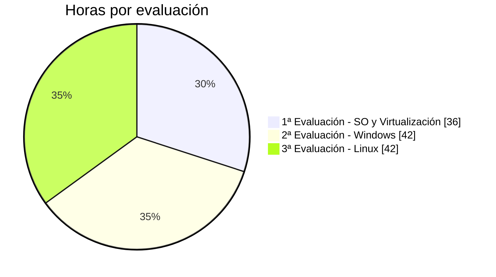
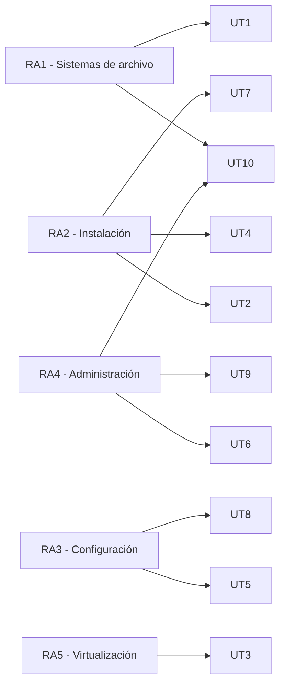

# Evaluación y distribución horaria

## Distribución horaria del curso

El módulo tiene una duración total de **120 horas**, repartidas en 3 evaluaciones y 10 unidades de trabajo.

### Desglose por unidad

| Evaluación | Unidad | Título | Horas | RA |
|---|---|---|---|---|
| 1ª | UT1 | Introducción a los SO y sistemas de archivo | 12h | RA1 |
| 1ª | UT2 | Hardware y requisitos de instalación | 10h | RA2 (intro) |
| 1ª | UT3 | Virtualización | 14h | RA5 |
| | | **Subtotal 1ª evaluación** | **36h** | |
| 2ª | UT4 | Instalación de Windows | 12h | RA2 |
| 2ª | UT5 | Configuración básica de Windows (+ PowerShell) | 14h | RA3 |
| 2ª | UT6 | Administración de Windows (permisos NTFS) | 16h | RA4 |
| | | **Subtotal 2ª evaluación** | **42h** | |
| 3ª | UT7 | Instalación de Linux | 10h | RA2 |
| 3ª | UT8 | Configuración básica de Linux (+ Bash) | 10h | RA3 |
| 3ª | UT9 | Administración de Linux (permisos y ACL) | 12h | RA4 |
| 3ª | UT10 | Compartición de archivos y cierre del proyecto | 10h | RA1, RA4 |
| | | **Subtotal 3ª evaluación** | **42h** | |
| | | **TOTAL CURSO** | **120h** | |

!!! note "Horas orientativas"
    Esta distribución es orientativa y puede ajustarse según el ritmo real del grupo, dedicando más sesiones a las unidades que presenten mayor dificultad práctica (especialmente UT6, UT9 y UT10, que concentran los contenidos más exigentes de administración y la integración final del proyecto).

### Cobertura de resultados de aprendizaje por unidad

---

## Sistema de evaluación

### Instrumentos de evaluación

Dado el enfoque eminentemente práctico del módulo, la evaluación se apoya en la comprobación del trabajo realizado sobre el **proyecto TechPyme** mediante un examen, el propio trabajo y pruebas teórico-prácticas puntuales.

| Instrumento | Peso | Descripción |
|---|---|---|
| **Examen** | 80% | Un examen por evaluación (o por bloque de unidades), combinando preguntas conceptuales y ejercicios relativos al proyecto |
| **Proyecto + Pruebas teórico-prácticas** | 20% | Ejercicios prácticos entregados y documentados a lo largo de cada unidad, evaluados con la rúbrica del apartado siguiente |

### Rúbrica de las prácticas

Cada práctica entregada se valora sobre los siguientes criterios:

| Criterio | Insuficiente (0-4) | Adecuado (5-7) | Excelente (8-10) |
|---|---|---|---|
| **Funcionalidad técnica** | La práctica no funciona o el resultado no es el esperado | La práctica funciona correctamente en los casos básicos planteados | Funciona correctamente, incluyendo casos límite o comprobaciones adicionales no pedidas explícitamente |
| **Aplicación de conceptos** | No se identifican los conceptos teóricos trabajados en la unidad | Se aplican correctamente los conceptos principales de la unidad | Se aplican con precisión, relacionándolos con otras unidades del curso cuando procede |
| **Documentación** | No se entrega evidencia (capturas, comandos usados, explicación) | Se entrega evidencia suficiente para verificar el trabajo realizado | La documentación es clara, ordenada y permitiría a otra persona reproducir el proceso |
| **Autonomía y resolución de problemas** | Necesita ayuda constante para completar la práctica | Resuelve de forma autónoma la mayoría de incidencias que surgen | Resuelve de forma autónoma y es capaz de explicar el porqué de los problemas encontrados |
| **Entrega en plazo** | No se entrega o se entrega con retraso no justificado | Se entrega dentro del plazo establecido | Se entrega dentro de plazo, con margen para revisión antes de la fecha límite |

!!! tip "Cómo se usa esta rúbrica"
    La nota de cada práctica es la media de los 5 criterios. La nota del bloque de Proyecto y prácticas de cada evalación es la media de todas las prácticas, con las prácticas de mayor peso conceptual (indicadas explícitamente en cada unidad) contando algo más si el profesor lo considera oportuno.

### Cálculo de la nota de cada evaluación

$$
\text{Nota evaluación} = 0{,}8 \times \text{Examen} + 0{,}2 \times \text{Proyecto y Prácticas} 
$$

### Cálculo de la nota final del curso

La nota final se calcula ponderando cada evaluación según su peso horario dentro del total del módulo (36h / 42h / 42h sobre 120h):

| Evaluación | Peso en la nota final |
|---|---|
| 1ª Evaluación | 30% (36h / 120h) |
| 2ª Evaluación | 35% (42h / 120h) |
| 3ª Evaluación | 35% (42h / 120h) |

!!! info "Alternativa: evaluación por RA"
    Si se prefiere una evaluación estrictamente por resultados de aprendizaje (como exige la normativa de FP en última instancia), la nota final del módulo se obtiene verificando que **todos los RA se han superado**, usando esta distribución horaria como referencia para ponderar el peso de cada uno en la nota, y las pruebas/prácticas de las unidades correspondientes como evidencia de su consecución.

### Recuperación

Los alumnos que no superen una evaluación podrán recuperar los contenidos no adquiridos mediante:

- Repetición de los exámenes de las evaluaciones no superadas, y la nueva entrega de las practicas y el proyecto.
- Una prueba de recuperación específica sobre los RA no alcanzados

