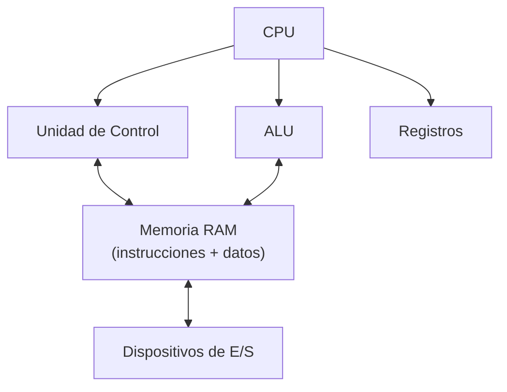
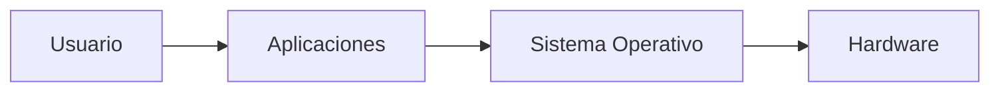

# UT1. Introducción a los Sistemas Operativos y Sistemas de Archivo

!!! abstract "Resultado de aprendizaje"
    **RA1.** Reconoce las características de los sistemas de archivo, describiendo sus tipos y aplicaciones.

## 1.1. Conceptos generales de Sistemas Operativos

### Arquitectura Von Neumann

Antes de hablar de qué es un Sistema Operativo conviene entender sobre qué **arquitectura física** se ejecuta: la inmensa mayoría de los ordenadores actuales (PCs, portátiles, smartphones, servidores...) siguen, con variaciones, el modelo propuesto en 1945 por el matemático **John von Neumann**.

La idea central de esta arquitectura es el **concepto de programa almacenado**: tanto las instrucciones (el programa) como los datos que ese programa maneja se guardan en la **misma memoria**, con el mismo formato binario. Gracias a esto un ordenador es una máquina de propósito general: basta con cargar un programa distinto en memoria para que realice una tarea diferente, sin cambiar el hardware.

**Componentes principales**

- **CPU (Unidad Central de Proceso)**, formada a su vez por:
    - **Unidad de Control (UC)**: lee las instrucciones de la memoria, las interpreta y coordina al resto de componentes para ejecutarlas
    - **Unidad Aritmético-Lógica (ALU)**: realiza las operaciones aritméticas (suma, resta...) y lógicas (comparaciones, AND, OR...)
    - **Registros**: memorias ultrarrápidas dentro de la CPU que guardan los datos con los que se está operando en cada instante
- **Memoria principal (RAM)**: almacena tanto las instrucciones del programa en ejecución como los datos que este utiliza
- **Dispositivos de entrada/salida (E/S)**: periféricos por los que el sistema recibe información del exterior (teclado, ratón, red...) o la envía (pantalla, impresora...)
- **Buses**: canales físicos que conectan todos los componentes y por los que circulan datos, direcciones de memoria y señales de control



!!! note "El «cuello de botella» de Von Neumann"
    Como instrucciones y datos comparten la misma memoria y el mismo bus de acceso a ella, la CPU no puede leer una instrucción y un dato al mismo tiempo. Este límite se conoce como **cuello de botella de Von Neumann** y es una de las razones por las que existen las memorias caché: reducen la necesidad de acceder constantemente a la RAM.

Sobre esta arquitectura física —CPU, memoria, dispositivos de E/S— se ejecuta todo el software. Pero el hardware, por sí solo, no hace nada útil: necesita un primer programa que arranque, tome el control de todos estos recursos y permita después ejecutar el resto de aplicaciones. Ese programa es precisamente el **Sistema Operativo**.

### ¿Qué es un Sistema Operativo?

Un **Sistema Operativo (SO)** es el software que gestiona los recursos hardware y software de un ordenador y proporciona servicios comunes a los programas de aplicación. Actúa como intermediario entre el usuario, las aplicaciones y el hardware.



### Funciones de un Sistema Operativo

Un sistema operativo desempeña seis grandes funciones. A continuación se desarrolla cada una en detalle, ya que son la base para entender el resto del módulo (procesos y rendimiento, memoria, sistemas de archivo, drivers, usuarios y permisos...).

#### Gestión de procesos

Un **proceso** es un programa en ejecución. El SO es responsable de crear, planificar, ejecutar y finalizar los procesos, repartiendo el tiempo de CPU entre todos ellos.

- **Creación y finalización**: cada vez que se abre una aplicación, el SO crea un proceso nuevo con su propio espacio de memoria e identificador (PID en Linux, PID también en Windows)
- **Planificación (scheduling)**: como una CPU solo puede ejecutar una instrucción por núcleo en cada instante, el SO decide qué proceso se ejecuta y durante cuánto tiempo, mediante algoritmos de planificación. Esto es lo que permite la sensación de "multitarea" aunque haya pocos núcleos
- **Estados de un proceso**: un proceso pasa por distintos estados a lo largo de su vida

    ```mermaid
    graph LR
        A[Nuevo] --> B[Listo]
        B --> C[En ejecución]
        C --> B
        C --> D[Bloqueado]
        D --> B
        C --> E[Terminado]
    ```

- **Procesos e hilos (threads)**: un proceso puede dividirse internamente en varios hilos de ejecución que comparten memoria pero se ejecutan de forma más o menos independiente, mejorando el aprovechamiento de CPUs con varios núcleos
- **Herramientas para observar procesos**: en Windows, el **Administrador de tareas**; en Linux, comandos como `ps`, `top` o `htop`

!!! example "En la práctica"
    Cuando un programa "deja de responder", normalmente es porque su proceso se ha quedado bloqueado o en un bucle. El SO permite finalizarlo manualmente (`Finalizar tarea` en Windows, `kill` en Linux) sin necesidad de reiniciar todo el equipo.

#### Gestión de memoria

La memoria RAM es un recurso limitado que deben compartir todos los procesos en ejecución. El SO se encarga de:

- **Asignar memoria** a cada proceso cuando se crea, y **liberarla** cuando termina
- **Aislar** el espacio de memoria de cada proceso, para que uno no pueda leer ni modificar la memoria de otro (protección de memoria)
- **Memoria virtual**: técnica que permite que los programas "crean" que tienen más memoria disponible de la que realmente hay, usando parte del disco como extensión de la RAM
    - En Windows se denomina **archivo de paginación** (pagefile)
    - En Linux se denomina **memoria de intercambio** (swap), habitualmente en una partición o fichero dedicado
- **Paginación**: la memoria se divide en bloques de tamaño fijo (páginas) que se pueden mover entre RAM y disco según se necesiten

!!! warning "Efecto de quedarse sin RAM"
    Cuando la RAM se agota y el sistema depende demasiado de la memoria virtual (disco), el rendimiento cae drásticamente, ya que el disco es mucho más lento que la RAM. Este fenómeno se conoce coloquialmente como *thrashing*.

#### Gestión de almacenamiento (sistemas de archivos)

El SO organiza la información en los dispositivos de almacenamiento mediante un **sistema de archivos**, que define cómo se guardan, nombran y localizan los ficheros y carpetas. Esta función incluye:

- Llevar el control de qué espacio del disco está libre y cuál está ocupado
- Mantener la estructura jerárquica de carpetas y archivos
- Guardar los metadatos de cada archivo: nombre, tamaño, fechas, permisos, ubicación física
- Ofrecer a los programas una interfaz sencilla (abrir, leer, escribir, cerrar un archivo) sin que estos tengan que preocuparse de en qué sector físico del disco están los datos

Esta función se desarrolla en profundidad en el apartado **1.3** de esta misma unidad, dedicado íntegramente a los sistemas de archivos.

#### Gestión de dispositivos (entrada/salida)

El SO actúa de intermediario entre los programas y todo el hardware conectado al equipo: teclado, ratón, pantalla, disco, tarjeta de red, impresora, etc.

- **Drivers (controladores)**: cada dispositivo necesita un programa específico que "traduce" las órdenes genéricas del SO a las instrucciones concretas que entiende ese hardware. Sin el driver adecuado, el dispositivo no funciona o no aprovecha todas sus capacidades
- **Buffers y colas**: el SO gestiona zonas de memoria temporal para compensar diferencias de velocidad entre dispositivos (por ejemplo, entre una impresora lenta y una CPU rápida)
- **Plug and Play**: capacidad de detectar automáticamente un dispositivo nuevo conectado y asignarle el driver correspondiente sin intervención manual
- Gestión centralizada:
    - Windows: **Administrador de dispositivos**
    - Linux: muchos dispositivos se gestionan mediante módulos del kernel, visibles con comandos como `lsusb`, `lspci` o `lsblk`

#### Gestión de la interfaz de usuario

El SO proporciona el medio por el cual el usuario interactúa con el equipo:

- **CLI (Command Line Interface / interfaz de línea de comandos)**: el usuario escribe comandos de texto. Ejemplos: la Terminal de Linux (bash, zsh), o PowerShell/CMD en Windows. Suele ser más rápida para tareas repetitivas o automatizables mediante scripts
- **GUI (Graphical User Interface / interfaz gráfica)**: el usuario interactúa mediante ventanas, iconos, menús y el ratón. Es más intuitiva para el usuario general
- Un mismo SO puede ofrecer ambas: Windows tiene su escritorio gráfico y también PowerShell/CMD; la mayoría de distribuciones Linux de escritorio ofrecen un entorno gráfico (GNOME, KDE, XFCE...) además de la terminal

!!! note "¿Por qué aprenderemos también la línea de comandos?"
    Aunque el uso diario suele ser gráfico, muchas tareas de administración (crear usuarios, configurar redes, automatizar backups) son más rápidas, más precisas y más fáciles de documentar mediante comandos. A lo largo del curso usaremos ambas interfaces, tanto en Windows como en Linux.

#### Gestión de la seguridad y control de acceso

El SO es responsable de proteger el sistema y sus datos frente a accesos no autorizados, tanto de otros usuarios como de otros procesos:

- **Autenticación**: comprobar que un usuario es quien dice ser, habitualmente mediante usuario y contraseña
- **Autorización**: una vez autenticado, determinar qué puede hacer ese usuario (qué archivos puede leer/modificar, qué programas puede ejecutar, qué configuraciones puede cambiar)
- **Usuarios y grupos**: el SO permite crear distintas cuentas de usuario y agruparlas, para poder asignar permisos de forma conjunta a varios usuarios con el mismo perfil (por ejemplo, todo el departamento de Contabilidad)
- **Permisos sobre archivos y carpetas**: cada sistema de archivos con soporte avanzado (NTFS, ext4...) permite definir quién puede leer, escribir o ejecutar cada elemento
- **Niveles de privilegio**: distinción entre un usuario estándar y uno con permisos administrativos (Administrador en Windows, root/sudo en Linux), para limitar qué cambios puede hacer cada perfil en el sistema

Esta función será especialmente relevante en las evaluaciones 2ª y 3ª, cuando configuremos los usuarios y grupos de TechPyme (Dirección, Compras, Ventas, Contabilidad, Técnico) tanto en Windows como en Linux.

---

### Clasificación de los sistemas operativos

| Criterio | Tipos |
|---|---|
| Número de usuarios | Monousuario / Multiusuario |
| Número de tareas | Monotarea / Multitarea |
| Gestión de puestos | Monopuesto / Red |
| Tiempo de respuesta | Tiempo real / Tiempo compartido |

!!! note "Sistemas monopuesto vs sistemas en red"
    Un **SO monopuesto** está diseñado para funcionar en un único equipo de forma autónoma. Un **SO de red** (o servidor) está preparado para gestionar recursos compartidos entre varios equipos. En este módulo trabajaremos principalmente con la vertiente monopuesto de Windows y Linux, aunque en la 3ª evaluación configuraremos un servidor de ficheros básico.

### Componentes de un Sistema Operativo

- **Kernel (núcleo)**: parte central que gestiona CPU, memoria y dispositivos
- **Shell**: intérprete de comandos que permite interactuar con el kernel
- **Sistema de archivos**: estructura que organiza la información en el almacenamiento
- **Drivers**: programas que permiten al SO comunicarse con dispositivos concretos

### Panorama de sistemas operativos actuales

=== "Windows"

    Desarrollado por Microsoft. Es el SO de escritorio más extendido en entornos domésticos y empresariales. Interfaz gráfica orientada al usuario final.

=== "Linux"

    Núcleo de código abierto sobre el que se construyen múltiples **distribuciones** (Ubuntu, Debian, Fedora, etc.). Muy usado en servidores, pero también en escritorio.

=== "macOS"

    Sistema operativo de Apple, basado en Unix, exclusivo para hardware propio.

---

## 1.2. Estructura física y lógica del almacenamiento

### Dispositivos de almacenamiento

- **HDD (disco duro mecánico)**: platos magnéticos giratorios, económico, más lento
- **SSD (unidad de estado sólido)**: memoria flash, mucho más rápido, sin partes móviles
- Otros: memorias USB, tarjetas SD, unidades de red (NAS)

### Estructura física de un disco (HDD)

- **Plato**: superficie circular donde se graba la información
- **Pista**: círculo concéntrico dentro del plato
- **Sector**: división mínima de una pista (habitualmente 512 bytes o 4 KB)
- **Cilindro**: conjunto de pistas a la misma distancia del centro en todos los platos

### Estructura lógica: particiones

Una **partición** es una división lógica de un disco que el sistema operativo trata como una unidad independiente.

- **Partición primaria**: puede contener un sistema de archivos y ser de arranque. Máximo 4 en un disco MBR.
- **Partición extendida**: contenedor especial que permite crear particiones lógicas (solo en MBR)
- **Partición lógica**: partición dentro de una extendida

### Esquemas de particionado: MBR vs GPT

| Característica | MBR | GPT |
|---|---|---|
| Año de origen | 1983 | 2010 (parte de UEFI) |
| Máximo de particiones primarias | 4 | 128 (en Windows) |
| Tamaño máximo de disco | 2 TB | > 9 ZB |
| Redundancia de la tabla de particiones | No | Sí (copia de seguridad) |
| Arranque asociado | BIOS/Legacy | UEFI |

!!! warning "Importante"
    Aunque GPT puede usarse con BIOS Legacy en algunos casos, la combinación habitual y recomendada hoy en día es **GPT + UEFI**, especialmente para discos superiores a 2 TB o instalaciones modernas de Windows y Linux.

### Arranque del sistema: BIOS/Legacy vs UEFI

- **BIOS (Legacy)**: firmware más antiguo, arranca a través del **MBR**, interfaz de texto
- **UEFI**: firmware moderno, arranca a través de la **partición EFI** en discos GPT, más rápido, soporta discos grandes, interfaz gráfica y ratón

---

## 1.3. Sistemas de archivos

### ¿Qué es un sistema de archivos?

Un **sistema de archivos** es la estructura lógica que un SO utiliza para organizar, nombrar, almacenar y recuperar los datos en una partición. Define cómo se guardan los ficheros y carpetas, sus metadatos (nombre, fecha, permisos) y cómo se gestiona el espacio libre.

### Sistemas de archivos en Windows

| Sistema | Características principales |
|---|---|
| **FAT16** | Muy antiguo, limitado a particiones pequeñas. En desuso |
| **FAT32** | Compatible con casi cualquier dispositivo, pero limita archivos a 4 GB |
| **exFAT** | Pensado para memorias flash, sin límite práctico de tamaño de archivo, buena compatibilidad multiplataforma |
| **NTFS** | Sistema nativo de Windows moderno: soporta journaling, permisos avanzados (ACL), cifrado, compresión y archivos de gran tamaño |

### Sistemas de archivos en Linux

| Sistema | Características principales |
|---|---|
| **ext2** | Sin journaling, en desuso salvo casos concretos |
| **ext3** | Añade journaling sobre ext2 |
| **ext4** | Estándar actual en muchas distribuciones, journaling, buen rendimiento, soporta archivos y particiones muy grandes |
| **btrfs / xfs** | Sistemas más avanzados con funciones como snapshots o mejor escalabilidad (mención) |

### Concepto de journaling

El **journaling** es una técnica mediante la cual el sistema de archivos registra los cambios que va a realizar antes de aplicarlos. Si se produce un corte de energía o un fallo, el sistema puede recuperar su consistencia leyendo ese "diario" de operaciones pendientes, evitando la corrupción de datos.

### Comparativa general

| Criterio | FAT32 | exFAT | NTFS | ext4 |
|---|---|---|---|---|
| Tamaño máx. de archivo | 4 GB | ~16 EB | ~16 TB | ~16 TB |
| Journaling | No | No | Sí | Sí |
| Permisos avanzados (ACL) | No | No | Sí | Sí (POSIX) |
| Compatibilidad Windows | Sí | Sí | Nativo | No (sin software extra) |
| Compatibilidad Linux | Sí | Sí (con paquete) | Sí (lectura/escritura) | Nativo |
| Uso recomendado | Dispositivos muy compatibles | USB/SD modernas | Disco de Windows | Disco de Linux |

### ¿Qué sistema de archivos elegir?

- **Disco interno de Windows** → NTFS
- **Disco interno de Linux** → ext4
- **Memoria USB para intercambiar archivos entre SO** → exFAT (o FAT32 si son archivos pequeños y el dispositivo es antiguo)
- **Disco de una cámara o dispositivo muy antiguo** → FAT32

---

## 1.4. Gestión de particiones y discos

### Herramientas en Windows

- **Administrador de discos** (`diskmgmt.msc`): herramienta gráfica para crear, redimensionar, eliminar y formatear particiones
- **diskpart**: herramienta de línea de comandos para las mismas tareas, útil en scripts o cuando la interfaz gráfica falla

```powershell
diskpart
list disk
select disk 1
clean
create partition primary
format fs=ntfs quick
assign letter=E
```

### Herramientas en Linux

- **GParted**: herramienta gráfica muy extendida, similar en concepto al administrador de discos de Windows
- **fdisk**: herramienta de texto para particionar discos con MBR (y soporte parcial de GPT)
- **parted**: herramienta de texto más moderna, con soporte completo de GPT

```bash
sudo fdisk -l
sudo parted /dev/sdb
(parted) mklabel gpt
(parted) mkpart primary ext4 0% 100%
```

### Herramientas multiplataforma

- **GParted Live**: distribución live booteable que permite particionar discos sin necesidad de un SO instalado, útil para tareas de mantenimiento

### Operaciones habituales

- **Crear** una partición nueva en espacio libre
- **Formatear**: aplicar un sistema de archivos a una partición
- **Redimensionar**: ampliar o reducir el tamaño de una partición existente
- **Eliminar**: borrar una partición (y su contenido)
- **Montar/desmontar**: hacer visible o retirar una partición del árbol de directorios (especialmente relevante en Linux)

!!! danger "Precaución"
    Las operaciones de particionado son **destructivas**: eliminar o reformatear una partición borra su contenido. Antes de practicar sobre un disco con datos reales, asegúrate de trabajar sobre una máquina virtual o un disco de pruebas.

---

## 1.5. Prácticas de la unidad

!!! abstract "Crear una máquina virtual en VirtualBox a partir de un archivo OVA"
    Para crear una máquina virtual en VirtualBox a partir de un archivo OVA, solo debes seguir estos pasos:
    - Haz doble clic sobre el archivo .ova en tu explorador de archivos.
    - VirtualBox se abrirá automáticamente y mostrará una ventana emergente llamada "Importar servicio virtual".
    - Revisa la configuración en la lista (puedes cambiar el nombre, la RAM o la CPU si lo deseas, aunque los valores por defecto suelen ser los correctos).
    - Haz clic en el botón "Importar" (o "Terminar") en la esquina inferior derecha.
    - Espera a que termine la barra de progreso.

Las entregas de las prácticas se realizaran siguiendo el formato definido [aqui](../entregas.md)

!!! example "Práctica 1 — Observando las funciones del SO en acción"
    El objetivo de esta práctica es identificar, con herramientas reales del sistema, cada una de las seis funciones del SO explicadas en el apartado 1.1.

    **Parte A — Gestión de procesos**

    1. Abre el Administrador de tareas (Windows) o `htop`/`top` (Linux)
    2. Identifica al menos 5 procesos en ejecución y anota su PID
    3. Abre una aplicación nueva (por ejemplo, el navegador) y observa cómo aparece un proceso nuevo
    4. Fuerza el cierre de un proceso no crítico (por ejemplo, el propio navegador) desde el Administrador de tareas / con `kill` y comprueba el efecto

    **Parte B — Gestión de memoria**

    1. Anota la cantidad total de RAM del equipo y la que está en uso en este momento
    2. Identifica los 3 procesos que más memoria están consumiendo
    3. Localiza dónde está configurada la memoria virtual: el archivo de paginación en Windows (`Propiedades del sistema → Configuración avanzada → Rendimiento`) o la partición/fichero de swap en Linux (`swapon --show` o `free -h`)

    **Parte C — Gestión de dispositivos**

    1. Abre el Administrador de dispositivos (Windows) o ejecuta `lsusb` y `lspci` (Linux)
    2. Localiza al menos 3 dispositivos distintos (por ejemplo, tarjeta de red, tarjeta gráfica, controlador USB)
    3. Comprueba si alguno tiene algún aviso de driver no instalado o con problemas

    **Parte D — Interfaz de usuario**

    1. Realiza una misma tarea sencilla de dos formas distintas: mediante la interfaz gráfica y mediante línea de comandos. Por ejemplo, crear una carpeta nueva:
        - Gráfico: clic derecho → Nueva carpeta
        - Comandos: `mkdir nombre_carpeta` (funciona en CMD/PowerShell y en la terminal de Linux)
    2. Anota qué diferencias observas entre ambos métodos (rapidez, claridad, posibilidad de automatizar)

    **Parte E — Seguridad y control de acceso**

    1. Comprueba con qué usuario has iniciado sesión y si tiene privilegios de administrador/root
    2. Intenta realizar una acción que requiera privilegios elevados (por ejemplo, instalar un programa o modificar un archivo del sistema) y observa cómo el SO te lo impide o te pide confirmación/contraseña

    **Entrega**

    Sigue el formato único descrito en [Entregas](../entregas.md): un apartado por cada parte (A-E), con su evidencia, explicación breve y autoevaluación.

!!! example "Práctica 2 — Inventario de almacenamiento"
    Sobre tu equipo (o una VM), identifica y documenta:

    1. Tipo de disco (HDD/SSD), tamaño y esquema de particionado (MBR o GPT)
    2. Número y tipo de particiones existentes
    3. Sistema de archivos de cada partición

    **Entrega:** formato único de [Entregas](../entregas.md).

!!! example "Práctica 3 — Particionado comparado"
    En una máquina virtual con un disco secundario vacío:

    1. Crea un esquema de particiones en **MBR** con dos particiones primarias
    2. Formatea una en FAT32 y otra en NTFS
    3. Repite el proceso creando un disco con esquema **GPT** y formatéalo en ext4 usando GParted
    4. Anota las diferencias observadas en el proceso

    **Entrega:** formato único de [Entregas](../entregas.md).

!!! example "Práctica 4 — Comparativa de sistemas de archivo"
    Copia el mismo conjunto de archivos (incluyendo alguno mayor de 4 GB si es posible) a particiones FAT32, exFAT y NTFS. Comprueba y documenta qué ocurre en cada caso.

    **Entrega:** formato único de [Entregas](../entregas.md).

!!! example "Práctica 5 — Simulación de incidencia"
    Elimina una partición de prueba (sin datos importantes) y utiliza una herramienta de recuperación básica (p. ej. TestDisk) para intentar recuperar la estructura. Documenta el proceso y el resultado.

    **Entrega:** formato único de [Entregas](../entregas.md).
