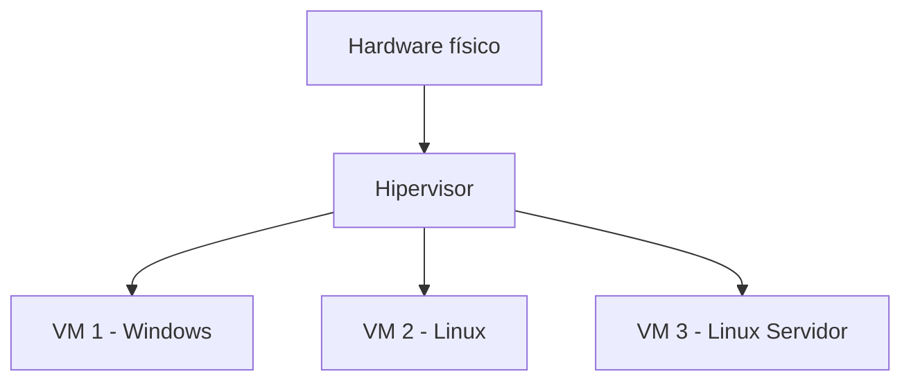
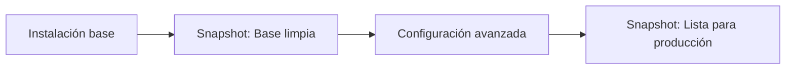

# UT3. Virtualización

!!! abstract "Resultado de aprendizaje"
    **RA5.** Crea máquinas virtuales identificando su campo de aplicación e instalando software específico.

## 3.1. Conceptos de virtualización

### ¿Qué es la virtualización?

La **virtualización** es la tecnología que permite crear versiones virtuales de recursos informáticos (equipos completos, discos, redes...) sobre un único equipo físico. Un mismo ordenador (host) puede ejecutar varias **máquinas virtuales (VM)**, cada una funcionando como si fuera un equipo independiente, con su propio sistema operativo.

### Host vs Guest

- **Host (anfitrión)**: equipo físico real sobre el que se ejecuta el software de virtualización
- **Guest (invitado)**: cada máquina virtual que se ejecuta dentro del host

### Tipos de hipervisores

| Tipo | Descripción | Ejemplos |
|---|---|---|
| **Tipo 1 (bare-metal)** | Se instala directamente sobre el hardware, sin SO intermedio. Uso en servidores/empresas | VMware ESXi, Microsoft Hyper-V (modo servidor), KVM |
| **Tipo 2 (hosted)** | Se instala como una aplicación sobre un SO ya existente. Uso habitual en equipos de escritorio | VirtualBox, VMware Workstation/Player |

En este curso trabajaremos principalmente con **VirtualBox**, un hipervisor de tipo 2, gratuito y multiplataforma.

### Ventajas e inconvenientes de virtualizar

**Ventajas**

- Aislamiento: los fallos de una VM no afectan al host ni a otras VMs
- Ahorro de hardware: varios "equipos" sobre una sola máquina física
- Snapshots: posibilidad de volver a un estado anterior fácilmente
- Portabilidad: una VM puede exportarse y moverse a otro equipo

**Inconvenientes**

- Consumo de recursos del host (CPU, RAM, disco) repartido entre todas las VMs
- Cierta pérdida de rendimiento respecto a un equipo físico dedicado
- Requiere que el host tenga soporte y virtualización activada en la BIOS/UEFI

---

## 3.2. Instalación y configuración del hipervisor

### Requisitos del host

- Soporte de virtualización por hardware (**VT-x** en Intel, **AMD-V** en AMD)
- Función activada en la BIOS/UEFI del equipo
- RAM y espacio en disco suficientes para alojar todas las VMs necesarias

### Instalación de VirtualBox

1. Descargar el instalador desde [virtualbox.org](https://www.virtualbox.org)
2. Ejecutar el instalador con las opciones por defecto
3. Instalar también el **VirtualBox Extension Pack** (funciones adicionales: USB 2.0/3.0, RDP, etc.)
4. Comprobar que la aplicación arranca correctamente y reconoce el soporte de virtualización del host

!!! tip "Comprobar la virtualización en Windows"
    Se puede verificar si la virtualización está activada abriendo el **Administrador de tareas → Rendimiento → CPU**, donde debe aparecer "Virtualización: Habilitada".

---

## 3.3. Creación y configuración de máquinas virtuales

### Asistente de creación de una VM

Al crear una nueva VM en VirtualBox se solicita:

- **Nombre** de la máquina virtual
- **Tipo y versión** de sistema operativo que se instalará (orienta la configuración por defecto)
- **Carpeta** donde se guardarán los ficheros de la VM

### Asignación de recursos

| Recurso | Recomendación general |
|---|---|
| **CPU (núcleos)** | 1-2 núcleos para clientes ligeros; ajustar según el host |
| **RAM** | Según requisitos del SO invitado, sin comprometer la RAM del host |
| **Aceleración gráfica** | Activar aceleración 3D si el entorno gráfico lo requiere |

### Discos virtuales

- **Formatos**: VDI (nativo de VirtualBox), VMDK (VMware), VHD (Hyper-V)
- **Tamaño fijo**: reserva todo el espacio de golpe, mejor rendimiento
- **Tamaño dinámico**: el fichero crece según se necesita, ahorra espacio en el host inicialmente

### Unidad óptica virtual y arranque

- Se puede "montar" una imagen ISO como si fuera un DVD insertado en la VM, para iniciar la instalación del SO
- El **orden de arranque** determina desde qué dispositivo virtual (disco, óptica, red) intenta arrancar la VM

---

## 3.4. Redes en entornos virtualizados

### Tipos de red virtual en VirtualBox

| Tipo de red | Descripción | Acceso a Internet | Acceso desde el host | Acceso entre VMs |
|---|---|---|---|---|
| **NAT** | La VM sale a través de la IP del host, oculta tras NAT | Sí | No directamente | No |
| **NAT Network** | Similar a NAT, pero permite comunicación entre varias VMs de la misma red NAT | Sí | No directamente | Sí |
| **Adaptador puente (Bridge)** | La VM obtiene una IP en la misma red física que el host, como si fuera un equipo más | Sí | Sí | Sí |
| **Red interna (Internal Network)** | Red aislada, solo visible entre las VMs conectadas a ella | No | No | Sí |
| **Solo anfitrión (Host-only)** | Red entre el host y las VMs, sin salida a Internet | No | Sí | Sí |

!!! example "Elección de red para TechPyme"
    Como TechPyme se implementa con solo **2 VMs** (una Windows, una Linux) y, puntualmente, el **equipo físico del alumno** como tercer nodo, la opción más práctica es el **Adaptador puente (Bridge)**: así, tanto las VMs como el host quedan en la misma red y pueden verse entre sí en cualquier combinación, sin tener que reconfigurar el tipo de red según qué prueba se esté haciendo. Como alternativa, si el aula no permite modo puente (por políticas de red del centro), se puede usar **Red solo anfitrión**, que también permite la comunicación VM↔host.

---

## 3.5. Gestión avanzada de máquinas virtuales

### Instantáneas (snapshots)

Una **snapshot** guarda el estado completo de una VM en un momento concreto (disco, memoria, configuración), permitiendo volver a él más adelante sin perder el resto del trabajo.

Casos de uso típicos:

- Guardar un estado "recién instalado" antes de empezar a practicar
- Probar cambios arriesgados con posibilidad de deshacer
- Preparar una plantilla base para clonar varias VMs similares

### Clonación de VMs

- **Clonación completa**: crea una copia totalmente independiente de la VM original
- **Clonación enlazada**: la copia depende del disco original y solo almacena las diferencias; ocupa menos espacio pero requiere mantener la VM original

### Exportación e importación (OVA/OVF)

Permite empaquetar una VM completa en un único archivo (`.ova`) para poder moverla o compartirla con otro equipo que tenga VirtualBox (u otro hipervisor compatible).

### Carpetas compartidas host-VM

VirtualBox permite compartir una carpeta del host con la VM, útil para intercambiar archivos entre ambos sin necesidad de red ni dispositivos externos (requiere las **Guest Additions** instaladas en la VM).

---

## 3.6. Prácticas de la unidad — Arranque del proyecto TechPyme

!!! example "Práctica 1 — Instalación del hipervisor"
    Instala VirtualBox y el Extension Pack en tu equipo de trabajo. Comprueba que la virtualización por hardware está activada.

!!! example "Práctica 2 — Diseño de la infraestructura virtual"
    TechPyme se implementará con **2 máquinas virtuales por alumno**, cada una alojando a varios departamentos como usuarios locales, más el equipo físico del alumno como tercer nodo, y un servidor Samba centralizado en el equipo del profesor (ya disponible en la red del aula, no se crea en esta práctica). Diseña el mapa de red de TechPyme:

    1. Lista de VMs necesarias y usuarios/departamentos que alojará cada una
    2. Tipo de red virtual que usarán (recomendado: adaptador puente, ver apartado 3.4)
    3. Tabla de direccionamiento IP previsto

    | Equipo | SO previsto | Usuarios/departamentos | Tipo de red | IP prevista |
    |---|---|---|---|---|
    | VM-WIN | Windows | Dirección, Compras, Ventas | Puente | 192.168.1.101 (DHCP) |
    | VM-LINUX | Linux | Contabilidad, Técnico | Puente | 192.168.1.102 (DHCP) |
    | Host físico | El del alumno | — | Puente (red del aula) | La que le asigne el router del aula |
    | VM-SRV-TECHPYME | Linux (equipo del profesor) | — (servidor) | Puente (red del aula) | La indicada por el profesor |

!!! example "Práctica 3 — Creación de las VMs vacías"
    Crea en VirtualBox las 2 máquinas virtuales previstas en la tabla anterior (sin instalar todavía el sistema operativo):

    - Configura nombre, tipo de SO, RAM y CPU de cada una, ajustando los recursos a lo que permita tu equipo
    - Crea el disco duro virtual correspondiente, con **tamaño dinámico** para ahorrar espacio
    - Configura el adaptador de red en modo puente en ambas VMs

!!! example "Práctica 4 — Snapshot inicial"
    Toma una snapshot de cada VM recién creada (estado "vacía, sin SO") con un nombre descriptivo, de forma que se pueda volver a este punto de partida en cualquier momento.

!!! example "Práctica 5 — Comprobación del host como tercer nodo"
    Sin necesidad de tener aún un SO instalado en las VMs, comprueba con tu profesor/a que tu equipo físico tiene conectividad de red normal (por ejemplo, acceso a Internet), para asegurarte de que el modo puente funcionará correctamente cuando llegue el momento de usar el host como tercer equipo de TechPyme.

!!! example "Práctica 6 — Documentación"
    Elabora un documento (puede ser el propio diagrama de red en formato imagen o Mermaid) que refleje la infraestructura virtual final de TechPyme —las 2 VMs y el papel del host físico—, listo para servir de referencia en las siguientes evaluaciones.
