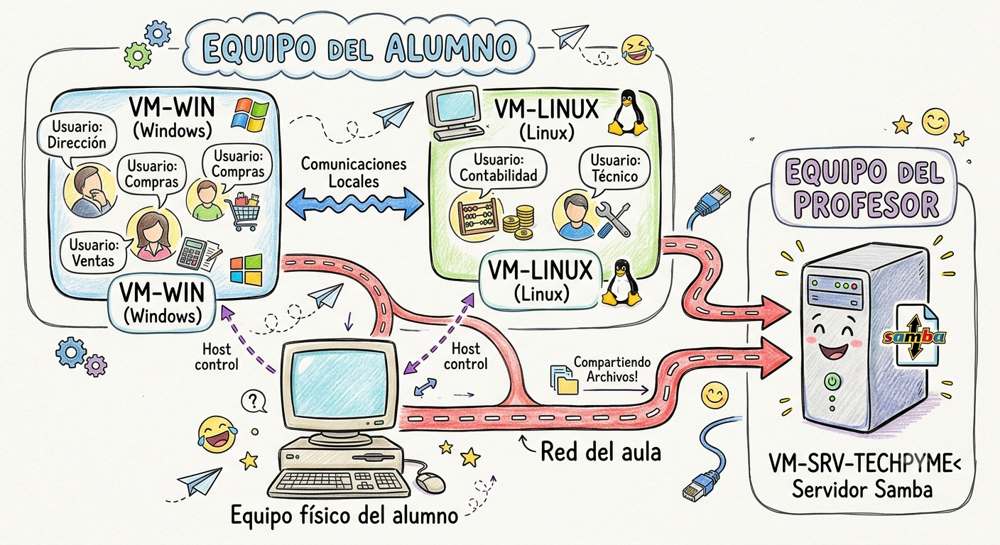

# Proyecto conductor: TechPyme S.L.

## Contexto

**TechPyme S.L.** es una pequeña empresa ficticia que utilizaremos como hilo conductor durante las 120 horas del módulo. Sobre ella iremos aplicando, de forma progresiva, todos los contenidos del curso.

La empresa cuenta con:

- Un departamento de **Dirección**
- Un departamento de **Compras**
- Un departamento de **Ventas**
- Un departamento de **Contabilidad**
- Un departamento **Técnico**

Cada departamento tiene usuarios propios, con permisos diferenciados, y debe poder compartir información de forma controlada con el resto de la empresa.

!!! info "Nota sobre el diseño del proyecto"
    Este proyecto está pensado para poder desarrollarse con **solo 2 máquinas virtuales por alumno**, adaptándose a equipos con recursos limitados (poco disco, poca RAM, y solo una VM arrancada a la vez). El servidor de ficheros de la empresa se aloja de forma centralizada en una VM del equipo del profesor, disponible para toda la clase.

## Infraestructura objetivo

Cada alumno trabaja con **2 VMs propias**, una por sistema operativo, cada una alojando como usuarios locales a los departamentos que le corresponden. El **servidor de ficheros Samba** no se instala en el equipo de cada alumno: se aloja en una única VM del **equipo del profesor**, y todos los alumnos se conectan a él a través de la red del aula.

| Máquina | Ubicación | Sistema Operativo | Usuarios / grupos que aloja | Rol |
|---|---|---|---|---|
| **VM-WIN** | Equipo del alumno | Windows | Dirección, Compras, Ventas | Cliente Windows |
| **VM-LINUX** | Equipo del alumno | Linux | Contabilidad, Técnico | Cliente Linux |
| **Host físico** | Equipo del alumno | El que tenga el alumno | — | Tercer nodo, para comprobar conexiones puntuales |
| **VM-SRV-TECHPYME** | Equipo del profesor | Linux | — | Servidor de ficheros Samba, centralizado para toda la clase |

!!! tip "¿Por qué el servidor va en el equipo del profesor?"
    Instalar y arrancar una tercera VM en cada equipo de alumno agravaría justo el problema de recursos que motivó este diseño (poco disco, poca RAM, solo una VM arrancada a la vez). Centralizando el servidor en el equipo del profesor:

    - Los alumnos no necesitan recursos adicionales para tener un servidor real y siempre disponible al que conectarse
    - Todos pueden comprobar en cualquier momento el acceso a recursos compartidos, sin depender de que un compañero tenga su propia VM encendida
    - Se practica un escenario más realista: en una empresa de verdad, el servidor de ficheros no suele estar en el propio puesto de trabajo

## El equipo físico como nodo adicional

Para comprobaciones rápidas que no impliquen al servidor del profesor (por ejemplo, verificar un recurso compartido entre dos usuarios de la misma VM, o entre las dos VMs del propio alumno), se puede seguir usando el equipo físico del alumno como tercer nodo de red, tal como se explica en la unidad de virtualización.

## Fases del proyecto

=== "1ª Evaluación"

    - Diseño de la infraestructura y del direccionamiento de red
    - Creación de las 2 VMs de TechPyme por alumno (aún vacías)
    - Configuración de la red virtual, de forma que las VMs del alumno puedan alcanzar la red del aula (y, con ella, el futuro servidor del profesor)

=== "2ª Evaluación"

    - Instalación de Windows en VM-WIN
    - Configuración de red, personalización
    - Creación de los usuarios/grupos de Dirección, Compras y Ventas, con permisos diferenciados
    - Carpetas compartidas entre esos usuarios dentro de VM-WIN

=== "3ª Evaluación"

    - Instalación de Linux en VM-LINUX
    - Configuración de usuarios, permisos y red en Linux
    - Creación de los usuarios/grupos de Contabilidad y Técnico
    - Compartición de carpetas entre los usuarios de VM-LINUX
    - Conexión desde VM-WIN y VM-LINUX al servidor Samba centralizado del profesor (VM-SRV-TECHPYME)
    - Integración final: comprobación de acceso al servidor desde ambas VMs y desde el host físico

!!! info "Objetivo final"
    Al terminar el curso, TechPyme dispondrá de un cliente Windows y un cliente Linux por alumno, correctamente configurados, con usuarios y permisos diferenciados por departamento, y acceso funcional a un servidor de ficheros Samba centralizado.
