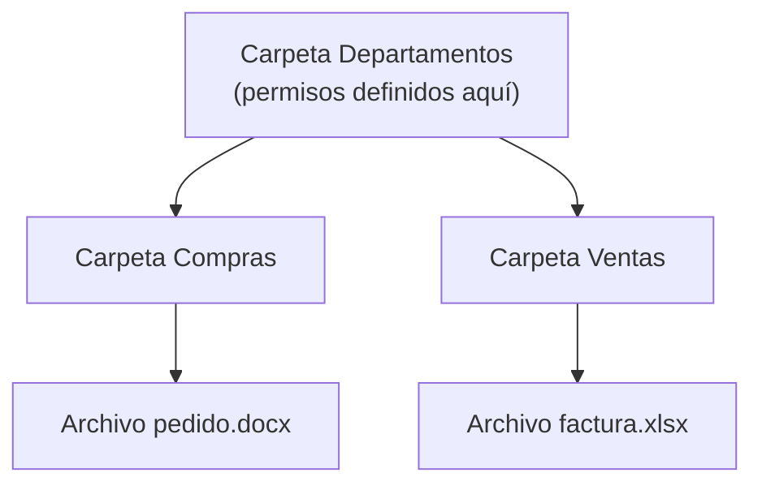

# UT6. Administración de Windows

!!! abstract "Resultado de aprendizaje"
    **RA4.** Realiza operaciones básicas de administración de sistemas operativos, interpretando requerimientos y optimizando el sistema para su uso.

## 6.1. Gestión de usuarios y grupos locales con PowerShell

### Cmdlets de usuarios locales

| Cmdlet | Función |
|---|---|
| `New-LocalUser` | Crear un usuario local |
| `Set-LocalUser` | Modificar propiedades de un usuario |
| `Remove-LocalUser` | Eliminar un usuario |
| `Get-LocalUser` | Consultar usuarios existentes |
| `Enable-LocalUser` / `Disable-LocalUser` | Activar o desactivar una cuenta |

```powershell
$clave = Read-Host -AsSecureString "Introduce la contraseña"
New-LocalUser -Name "jgarcia" -FullName "Juan García" -Password $clave -Description "Departamento de Compras"
```

### Cmdlets de grupos locales

| Cmdlet | Función |
|---|---|
| `New-LocalGroup` | Crear un grupo local |
| `Add-LocalGroupMember` | Añadir un usuario a un grupo |
| `Remove-LocalGroupMember` | Quitar un usuario de un grupo |
| `Get-LocalGroupMember` | Listar los miembros de un grupo |
| `Get-LocalGroup` | Consultar grupos existentes |

```powershell
New-LocalGroup -Name "Compras" -Description "Departamento de Compras de TechPyme"
Add-LocalGroupMember -Group "Compras" -Member "jgarcia"
```

### Diseño de la estructura de TechPyme

Para VM-WIN se crearán tres grupos, uno por departamento, y al menos un usuario de ejemplo en cada uno:

| Grupo | Usuarios (ejemplo) |
|---|---|
| Dirección | direccion01 |
| Compras | compras01 |
| Ventas | ventas01 |

### Políticas de contraseña

```powershell
Set-LocalUser -Name "jgarcia" -PasswordNeverExpires $false
```

Las políticas más avanzadas de contraseña (longitud mínima, complejidad, caducidad a nivel de sistema) se gestionan desde el editor de políticas de seguridad local (`secpol.msc`), vinculado con lo visto sobre `gpedit.msc` en la UT5.

---

## 6.2. Permisos NTFS en profundidad

Este es uno de los apartados más importantes de la evaluación: de él depende que cada departamento de TechPyme solo pueda acceder a la información que le corresponde.

### Repaso: NTFS y permisos

Como se vio en la UT1, **NTFS** es el sistema de archivos nativo de Windows que soporta permisos avanzados (ACL, *Access Control List*), a diferencia de FAT32/exFAT.

### Permisos básicos

Son los que aparecen por defecto en la pestaña **Seguridad** de las propiedades de una carpeta o archivo:

| Permiso básico | Permite |
|---|---|
| **Control total** | Todas las operaciones, incluyendo cambiar permisos y tomar posesión |
| **Modificar** | Leer, escribir, ejecutar y eliminar |
| **Lectura y ejecución** | Leer el contenido y ejecutar archivos ejecutables/scripts |
| **Mostrar el contenido de la carpeta** | Solo aplicable a carpetas: ver qué archivos/subcarpetas contiene |
| **Lectura** | Ver el contenido de archivos y propiedades |
| **Escritura** | Crear archivos/subcarpetas y modificar atributos |

### Permisos especiales (avanzados)

Cada permiso básico es en realidad una combinación de **permisos especiales**, más granulares. Los más relevantes:

| Permiso especial | Significado |
|---|---|
| Recorrer carpeta / Ejecutar archivo | Moverse a través de una carpeta aunque no se tenga acceso a su contenido / ejecutar un programa |
| Listar carpeta / Leer datos | Ver el nombre de archivos y subcarpetas / leer el contenido de un archivo |
| Leer atributos | Ver atributos básicos (solo lectura, oculto...) |
| Leer atributos extendidos | Ver atributos definidos por programas concretos |
| Crear archivos / Escribir datos | Añadir archivos nuevos a una carpeta / modificar el contenido de un archivo |
| Crear carpetas / Anexar datos | Añadir subcarpetas / añadir datos al final de un archivo sin modificar lo existente |
| Eliminar subcarpetas y archivos | Eliminar el contenido de una carpeta, aunque el archivo individual esté protegido |
| Eliminar | Eliminar el propio archivo o carpeta |
| Leer permisos | Ver la lista de permisos asignados |
| Cambiar permisos | Modificar la lista de permisos (sin necesidad de Control total) |
| Tomar posesión | Convertirse en el propietario del archivo/carpeta |

!!! note "¿Cuándo importan los permisos especiales?"
    En el día a día, trabajar con los permisos básicos es suficiente en la mayoría de los casos. Los permisos especiales se vuelven relevantes en escenarios más finos: por ejemplo, permitir que un usuario **elimine archivos que él mismo ha creado dentro de una carpeta**, pero no archivos de otros usuarios (requiere combinar permisos especiales concretos en lugar de un permiso básico genérico).

### Permitir vs Denegar

Cada permiso, básico o especial, se puede asignar en modo **Permitir** o **Denegar**.

!!! danger "Regla fundamental"
    Un **Denegar** explícito siempre prevalece sobre cualquier **Permitir**, sin importar de dónde venga ese "Permitir" (directamente asignado, heredado, o proveniente de otro grupo al que pertenezca el usuario).

Por eso, en la práctica, se recomienda usar "Denegar" con mucha moderación, ya que un denegar mal ubicado puede bloquear el acceso de forma difícil de depurar. Normalmente es preferible **no incluir** a un usuario/grupo en los permisos "Permitir" antes que añadir explícitamente un "Denegar".

### Herencia de permisos

Por defecto, una subcarpeta y los archivos que contiene **heredan** los permisos de la carpeta superior.



- Los permisos heredados aparecen "en gris" en la interfaz gráfica (no se pueden quitar directamente desde ese nivel)
- Se puede **deshabilitar la herencia** en un punto concreto del árbol, para que esa carpeta (y lo que cuelgue de ella) deje de heredar cambios futuros del nivel superior:
    - Al deshabilitar la herencia, Windows pregunta si se quieren **convertir** los permisos heredados en permisos explícitos (mantenerlos tal cual, pero ya como propios) o **quitarlos** todos y empezar de cero

!!! example "Caso de uso en TechPyme"
    La carpeta general `Departamentos` puede tener permisos de lectura para todo el personal. Pero dentro, la subcarpeta `Dirección` debe dejar de heredar esos permisos generales y definir los suyos propios, mucho más restrictivos, para que Compras y Ventas no puedan acceder a ella.

### Permisos efectivos

Cuando un usuario pertenece a **varios grupos**, y cada grupo tiene permisos distintos sobre el mismo recurso, los permisos **se acumulan** (salvo que exista un Denegar, que siempre gana).

- Windows ofrece una pestaña de **"Permisos efectivos"** (dentro de Seguridad avanzada) donde se puede simular qué permiso final tendría un usuario o grupo concreto sobre un recurso, teniendo en cuenta todas las combinaciones
- Es la herramienta más fiable para depurar problemas de acceso, en vez de revisar manualmente cada grupo

### Propietario (Owner) y toma de posesión

Todo archivo y carpeta tiene un **propietario**, que por defecto es quien lo creó. El propietario, incluso sin permisos explícitos de Control total, puede modificar los permisos del recurso.

- Un administrador puede **tomar posesión** (*Take Ownership*) de un archivo o carpeta que no le pertenece, típicamente para poder recuperar el acceso a datos de un usuario que ya no está disponible
- Desde PowerShell, tomar posesión se hace a través de `Set-Acl`, o con la herramienta clásica `takeown`

### Permisos NTFS vs permisos de recurso compartido

Al acceder a una carpeta **por red**, se aplican **dos capas de permisos** simultáneamente:

1. Los permisos NTFS de la carpeta (los que estamos viendo en este apartado)
2. Los permisos del propio recurso compartido (vistos en el apartado 6.3)

!!! danger "Regla clave"
    El permiso final que tiene un usuario al acceder por red es siempre **el más restrictivo de los dos**. Si el recurso compartido permite "Control total" pero NTFS solo permite "Lectura", el usuario solo podrá leer. Y viceversa.

### Gestión de permisos NTFS con PowerShell

```powershell
# Consultar los permisos actuales de una carpeta
Get-Acl -Path "C:\Departamentos\Compras"

# Crear una regla de acceso nueva
$regla = New-Object System.Security.AccessControl.FileSystemAccessRule(
    "TECHPYME\Compras", "Modify", "ContainerInherit,ObjectInherit", "None", "Allow"
)

# Aplicar la regla a la carpeta
$acl = Get-Acl -Path "C:\Departamentos\Compras"
$acl.SetAccessRule($regla)
Set-Acl -Path "C:\Departamentos\Compras" -AclObject $acl
```

!!! note "icacls como alternativa clásica"
    Antes de que PowerShell fuera la herramienta estándar, la gestión de permisos por línea de comandos se hacía con `icacls`. Sigue disponible y es útil conocerla, aunque en este curso usaremos preferentemente `Get-Acl`/`Set-Acl`:
    ```powershell
    icacls "C:\Departamentos\Compras" /grant "TECHPYME\Compras:(M)"
    ```

### Auditoría básica de acceso

Windows permite auditar quién accede a un archivo o carpeta y qué operaciones realiza (lectura, escritura, eliminación...), configurando el **SACL** (*System Access Control List*) desde la pestaña Seguridad avanzada → Auditoría. Se menciona aquí como introducción; su configuración completa (activar la directiva de auditoría a nivel de sistema y definir qué eventos registrar) queda fuera del alcance de esta unidad.

---

## 6.3. Recursos compartidos en red

### Compartir carpetas con PowerShell

```powershell
New-SmbShare -Name "Compras" -Path "C:\Departamentos\Compras" -FullAccess "TECHPYME\Compras"
Get-SmbShare
Remove-SmbShare -Name "Compras"
```

### Permisos de recurso compartido

```powershell
Grant-SmbShareAccess -Name "Compras" -AccountName "TECHPYME\Ventas" -AccessRight Read
```

Los niveles de permiso de un recurso compartido son más simples que los NTFS: **Lectura**, **Cambiar** (modificar) y **Control total**. Como se ha visto en el apartado anterior, el resultado final combinado con NTFS siempre es el más restrictivo de ambos.

### Acceso desde otro equipo

Un recurso compartido se accede desde otro equipo mediante su **ruta UNC**:

```
\\PC-TECHPYME-WIN\Compras
```

### Comprobación desde el host físico

Aplicando lo visto en la UT3 sobre el uso del host físico como tercer nodo de red: desde el equipo físico del alumno, se puede escribir la ruta UNC del recurso compartido en el explorador de archivos para comprobar el acceso real, sin necesidad de una segunda VM encendida.

---

## 6.4. Gestión de discos y almacenamiento

### Cmdlets de gestión de discos

| Cmdlet | Función |
|---|---|
| `Get-Disk` | Lista los discos del sistema |
| `Get-Partition` | Lista las particiones |
| `Get-Volume` | Lista los volúmenes con su sistema de archivos y espacio libre |
| `New-Partition` | Crea una partición nueva |
| `Format-Volume` | Formatea un volumen con un sistema de archivos |

```powershell
Get-Disk
Get-Volume
```

### Letras de unidad y montaje de carpetas

Además de las letras de unidad tradicionales (`C:`, `D:`...), Windows permite **montar** un volumen dentro de una carpeta vacía de otra unidad, de forma similar (aunque no idéntica) al montaje de particiones en Linux que se verá en la 3ª evaluación.

### Cuotas de disco

Windows permite limitar el espacio en disco que puede ocupar cada usuario en un volumen concreto, desde las propiedades del volumen → pestaña Cuota. Se menciona como introducción, sin entrar en su configuración detallada en esta unidad.

---

## 6.5. Tareas programadas y rendimiento

### Programador de tareas con PowerShell

```powershell
$accion = New-ScheduledTaskAction -Execute "notepad.exe"
$disparador = New-ScheduledTaskTrigger -Daily -At 9am
Register-ScheduledTask -TaskName "AvisoDiario" -Action $accion -Trigger $disparador

Get-ScheduledTask -TaskName "AvisoDiario"
```

### Consulta de rendimiento

```powershell
Get-Process | Sort-Object CPU -Descending | Select-Object -First 10
Get-Counter '\Processor(_Total)\% Processor Time'
```

`Get-Counter` permite leer contadores de rendimiento del sistema (CPU, memoria, disco, red) directamente desde PowerShell, como alternativa al Monitor de rendimiento gráfico.

### Servicios

```powershell
Get-Service | Where-Object {$_.Status -eq "Running"}
Stop-Service -Name "Spooler"
Start-Service -Name "Spooler"
```

---

## 6.6. Copias de seguridad básicas

### Herramientas integradas

Windows incluye herramientas de copia de seguridad de archivos y de creación de imágenes del sistema, accesibles desde `Configuración → Actualización y seguridad → Copia de seguridad`.

### Puntos de restauración

Un **punto de restauración** guarda el estado de los archivos de sistema y el registro en un momento dado, permitiendo deshacer cambios problemáticos (como una actualización o instalación fallida) sin afectar a los documentos personales.

```powershell
Checkpoint-Computer -Description "Antes de instalar Samba client" -RestorePointType "MODIFY_SETTINGS"
```

!!! note "Copia de seguridad de datos vs punto de restauración"
    Un punto de restauración protege la **configuración del sistema**, no sustituye a una copia de seguridad de los **documentos y datos** del usuario, que requiere una herramienta de backup de archivos independiente.

---

## 6.7. Prácticas de la unidad — Administración de VM-WIN

!!! example "Práctica 1 — Usuarios y grupos"
    Con PowerShell, crea en VM-WIN:

    1. Los grupos `Direccion`, `Compras` y `Ventas`
    2. Al menos un usuario en cada grupo, con contraseña segura
    3. Consulta con `Get-LocalGroupMember` que cada grupo tiene el usuario esperado

!!! example "Práctica 2 — Estructura de carpetas y permisos NTFS"
    1. Crea una estructura de carpetas `C:\Departamentos\Direccion`, `C:\Departamentos\Compras`, `C:\Departamentos\Ventas`
    2. Asigna permisos NTFS diferenciados: cada grupo debe tener Modificar sobre su propia carpeta, y no debe tener ningún permiso (ni heredado) sobre las de los demás departamentos
    3. En la carpeta `Direccion`, deshabilita la herencia y configura un **Denegar explícito** para el grupo `Compras`
    4. Comprueba con la pestaña de **Permisos efectivos** qué acceso tendría un usuario que perteneciera simultáneamente a `Compras` y `Direccion`

!!! example "Práctica 3 — Recursos compartidos"
    1. Comparte por red la carpeta de cada departamento con `New-SmbShare`
    2. Ajusta los permisos de recurso compartido con `Grant-SmbShareAccess`
    3. Desde el host físico del alumno, accede a la ruta UNC de una de las carpetas compartidas y comprueba que el acceso obtenido coincide con lo esperado (NTFS + recurso compartido combinados)

!!! example "Práctica 4 — Tareas programadas y rendimiento"
    1. Crea una tarea programada sencilla con `Register-ScheduledTask`
    2. Consulta los 5 procesos que más CPU consumen en este momento

!!! example "Práctica 5 — Copia de seguridad"
    Crea un punto de restauración del sistema con `Checkpoint-Computer` antes de continuar con la siguiente evaluación.

!!! example "Práctica 6 — Documentación final"
    Elabora una matriz de permisos que resuma, para cada carpeta de departamento, qué grupo tiene qué nivel de acceso NTFS y qué nivel de acceso de recurso compartido. Esta documentación cerrará el bloque de Windows del proyecto TechPyme.
