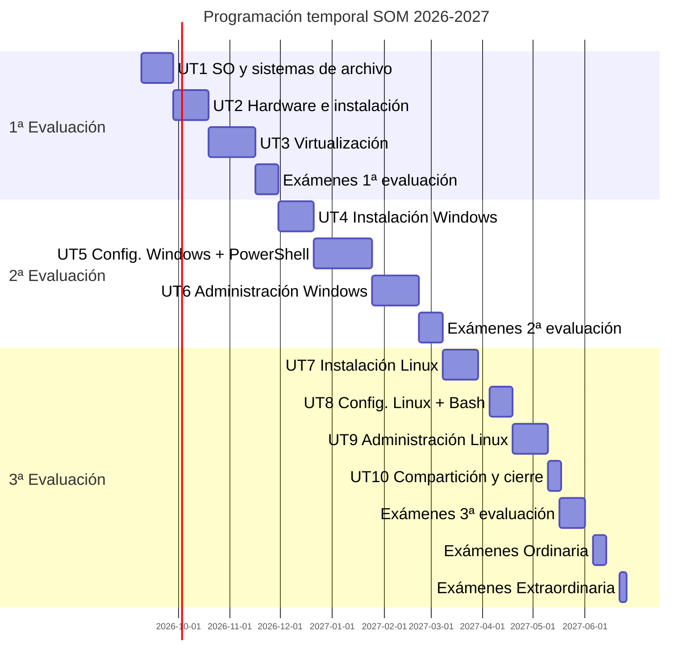

---
hide:
  - navigation
  - toc
---

# Programación temporal — Diagrama completo

[← Volver a la página de Programación temporal](calendario.md)

```mermaid
%%{init: {'gantt': {'barHeight': 34, 'barGap': 8, 'fontSize': 18, 'sectionFontSize': 18, 'topPadding': 60, 'leftPadding': 160}}}%%
gantt
    dateFormat  YYYY-MM-DD
    title Programación temporal SOM 2026-2027
    section 1ª Evaluación
  UT1 SO y sistemas de archivo      :2026-09-09, 19d
  UT2 Hardware e instalación        :2026-09-28, 21d
  UT3 Virtualización                :2026-10-19, 28d
  Exámenes 1ª evaluación            :2026-11-16, 14d
    section 2ª Evaluación
  UT4 Instalación Windows           :2026-11-30, 21d
  UT5 Config. Windows + PowerShell  :2026-12-21, 35d
  UT6 Administración Windows        :2027-01-25, 28d
  Exámenes 2ª evaluación            :2027-02-22, 14d
    section 3ª Evaluación
  UT7 Instalación Linux             :2027-03-08, 21d
  UT8 Config. Linux + Bash          :2027-04-05, 14d
  UT9 Administración Linux          :2027-04-19, 21d
  UT10 Compartición y cierre        :2027-05-10, 8d
  Exámenes 3ª evaluación            :2027-05-17, 15d
  Exámenes Ordinaria                :2027-06-06, 8d
  Exámenes Extraordinaria           :2027-06-22, 4d
```
