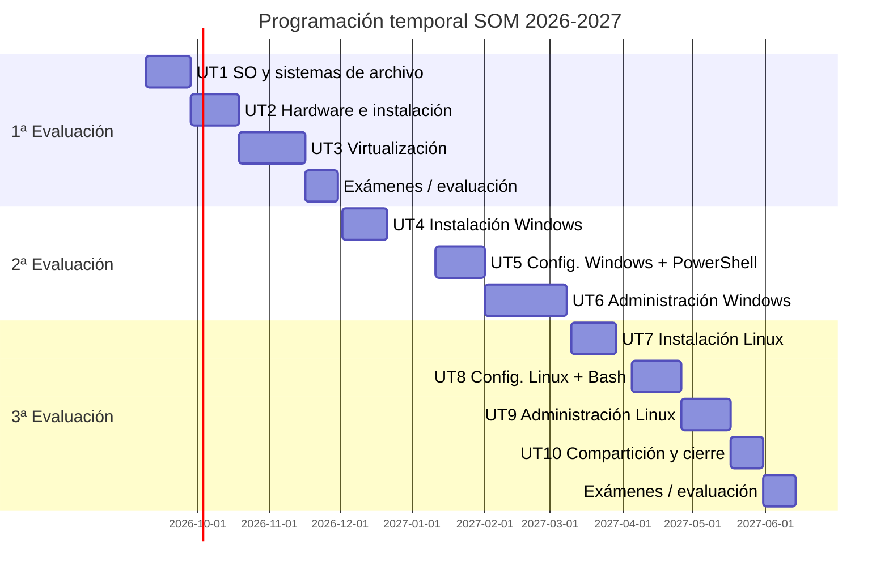

# Programación temporal (curso 2026-2027)

## Fechas clave del curso (1r)

| Hito | Fecha |
|---|---|
| Inicio de curso | 9 de septiembre de 2026 |
| 1ª Evaluación | 17 de noviembre de 2026 |
| Vacaciones de Navidad | 21 de diciembre de 2026 – 10 de enero de 2027 |
| 2ª Evaluación | 23 de febrero de 2027 |
| Fallas | 16 - 21 de marzo de 2027 |
| Semana Santa | 25 de marzo – 5 de abril de 2027 |
| 3ª Evaluación | 18 de mayo de 2027 |
| Evaluación ordinaria | 7 de junio de 2027 |
| Evaluación extraordinaria | 23 de junio de 2027 |

---

## Desglose completo por unidad de trabajo

| Evaluación | Unidad | Título | Fechas | Semanas | Horas |
|---|---|---|---|---|---|
| 1ª | UT1 | Introducción a los SO y sistemas de archivo | 9 – 27 sept | 3 | 12h |
| 1ª | UT2 | Hardware y requisitos de instalación | 28 sept – 18 oct | 3 | 10h |
| 1ª | UT3 | Virtualización | 19 oct – 15 nov | 4 | 14h |
| 1ª | — | **Exámenes 1 evaluación** | 16 – 29 nov | 2 | — |
| 2ª | UT4 | Instalación de Windows | 30 Nov – 20 dic | 3 | 12h |
| | | *(Vacaciones de Navidad: 21 dic – 10 ene)* | | | |
| 2ª | UT5 | Configuración básica de Windows + introducción a PowerShell | 21 dic – 24 ene | 3 | 14h |
| 2ª | UT6 | Administración de Windows — usuarios, grupos y permisos NTFS (parte 1) | 25 ene – 21 feb | 3 | 16h |
| 2ª | — | **Exámenes  2 evaluación** | 22 feb – 7 mar | 2 | — |
| 3ª | UT7 | Instalación de Linux | 8 – 28 mar | 3 | 10h |
| | | *(Fallas: 16 mar – 21 mar)* | | | |
| | | *(Semana Santa: 25 mar – 5 abr)* | | | |
| 3ª | UT8 | Configuración básica de Linux + introducción a Bash | 5 – 18 abr | 2 | 10h |
| 3ª | UT9 | Administración de Linux — permisos y ACL | 19 abr – 9 mayo | 3 | 12h |
| 3ª | UT10 | Compartición de archivos y cierre del proyecto TechPyme | 10 – 17 mayo | 1 | 10h |
| 3ª | — | **Exámenes   3 evaluación** | 17 mayo – 31 mayo | 2 | — |
|  |  | **Exámenes Ordinaria** | 6 junio - 13 junio |  |  |
|  |  | **Exámenes Extraordinaria** | 22 junio - 25 junio |  |  |

---

## Resumen visual

[:material-arrow-expand: Ver el diagrama a pantalla completa (se abre en una pestaña nueva)](calendario-gantt.md){:target="_blank"}

