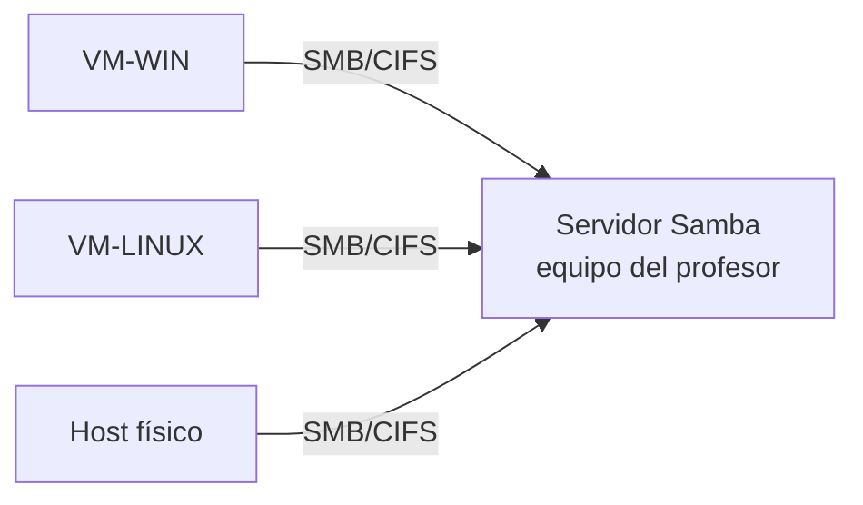
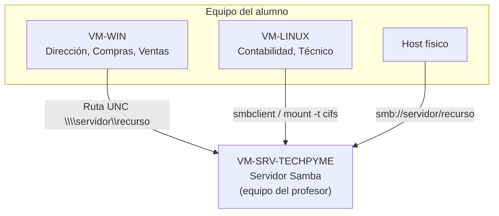

# UT10. Compartición de archivos y cierre del proyecto

!!! abstract "Resultados de aprendizaje"
    **RA1.** Reconoce las características de los sistemas de archivo, describiendo sus tipos y aplicaciones.
    **RA4.** Realiza operaciones básicas de administración de sistemas operativos, interpretando requerimientos y optimizando el sistema para su uso.

## 10.1. Compartir archivos entre sistemas distintos

Windows y Linux no "hablan" el mismo protocolo de red para compartir archivos de forma nativa. Para que ambos mundos puedan intercambiar información, hace falta un protocolo común: **SMB/CIFS**, el mismo que usan de forma nativa los recursos compartidos de Windows vistos en la **UT6**.



---

## 10.2. Samba: conceptos básicos

**Samba** es el software que permite a un sistema Linux implementar el protocolo SMB/CIFS, tanto para **ofrecer** recursos compartidos (actuando de servidor) como para **acceder** a recursos compartidos de otros equipos, sean Windows o Linux (actuando de cliente).

### Conceptos clave

| Concepto | Significado |
|---|---|
| **Grupo de trabajo** | Agrupación lógica de equipos en una red local (equivalente al grupo de trabajo de Windows visto en UT5) |
| **Recurso compartido (share)** | Una carpeta concreta que un servidor Samba pone a disposición de la red |
| **Usuario Samba** | Cuenta con la que un cliente se autentica ante el servidor Samba; puede coincidir o no con el usuario del sistema |

### Servidor vs cliente Samba

- **Servidor Samba**: aloja recursos compartidos y controla qué usuarios pueden acceder a ellos
- **Cliente Samba**: se conecta a recursos compartidos ofrecidos por un servidor (Samba u otro Windows)

En el proyecto TechPyme, el **servidor** Samba está centralizado en el equipo del profesor; VM-WIN y VM-LINUX actúan como **clientes**.

---

## 10.3. VM-LINUX como cliente Samba

### Instalación del cliente

```bash
sudo apt update
sudo apt install smbclient cifs-utils
```

- `smbclient`: herramienta para explorar y navegar recursos compartidos desde la terminal
- `cifs-utils`: permite montar recursos SMB/CIFS como si fueran una carpeta más del sistema de archivos

### Explorar recursos compartidos disponibles

```bash
smbclient -L //192.168.1.50 -U nombre_usuario
```

Este comando lista los recursos compartidos disponibles en el servidor indicado, tras pedir la contraseña del usuario.

### Montar un recurso remoto

```bash
sudo mkdir -p /mnt/techpyme
sudo mount -t cifs //192.168.1.50/techpyme /mnt/techpyme -o username=nombre_usuario
```

Para que el recurso se monte automáticamente en cada arranque, se puede añadir una entrada en `/etc/fstab` (visto en la UT9), usando el tipo `cifs` en lugar de `ext4`.

### Acceso desde el gestor de archivos gráfico

La mayoría de gestores de archivos gráficos de Linux permiten conectarse directamente a un recurso SMB escribiendo una dirección con el formato:

```
smb://192.168.1.50/techpyme
```

sin necesidad de montarlo previamente por terminal.

---

## 10.4. Mención guiada: cómo se instalaría un servidor Samba

Aunque en TechPyme el servidor real está centralizado en el equipo del profesor, es importante entender **conceptualmente** cómo se configuraría, ya que forma parte del resultado de aprendizaje RA1 sobre sistemas de archivo y su aplicación en red.

### El paquete samba y su configuración

Un servidor Samba se instalaría con:

```bash
sudo apt install samba
```

Y se configuraría editando el fichero `/etc/samba/smb.conf`, donde se definen los recursos compartidos:

```ini
[techpyme]
   path = /srv/samba/techpyme
   browseable = yes
   read only = no
   valid users = @contabilidad, @tecnico
```

Cada bloque entre corchetes (`[techpyme]`) define un recurso compartido: su ruta en el disco, si es visible al explorar la red, si admite escritura, y qué usuarios o grupos pueden acceder.

### Herramientas de verificación y gestión

| Comando | Función |
|---|---|
| `testparm` | Comprueba que la sintaxis de `smb.conf` es correcta antes de aplicar cambios |
| `smbpasswd -a usuario` | Da de alta a un usuario del sistema como usuario Samba, con su propia contraseña de acceso |

!!! info "Por qué no se instala en cada VM del alumno"
    Como se explicó en el **Proyecto TechPyme**, mantener un servidor Samba en cada equipo de alumno exigiría una tercera VM, agravando la falta de recursos (disco y RAM) de las máquinas del aula. Por eso el servidor está centralizado en el equipo del profesor, y el alumno se centra en el papel de **cliente**, que es además el escenario más habitual en un puesto de trabajo real.

---

## 10.5. NFS como alternativa nativa Linux-Linux

**NFS** (*Network File System*) es otro protocolo de compartición de archivos en red, nativo del mundo Unix/Linux.

| Característica | Samba (SMB/CIFS) | NFS |
|---|---|---|
| Origen | Protocolo de Windows, implementado en Linux | Protocolo nativo Unix/Linux |
| Redes mixtas (Windows + Linux) | Sí, es su punto fuerte | No de forma nativa (requiere software adicional en Windows) |
| Uso típico | Redes de oficina con equipos Windows y Linux | Redes homogéneas de servidores/equipos Linux |

!!! note "¿Cuándo usar cada uno?"
    En una empresa como TechPyme, con equipos Windows y Linux que deben compartir el mismo servidor de ficheros, **Samba** es la opción natural. NFS tendría sentido si TechPyme fuera una infraestructura compuesta únicamente por servidores y equipos Linux, sin necesidad de dar servicio a clientes Windows.

---

## 10.6. Integración final del proyecto TechPyme

Con todo lo trabajado a lo largo del curso, llega el momento de comprobar que las piezas encajan:



### Comprobaciones finales

1. **Desde VM-WIN**: acceso al recurso compartido del servidor mediante ruta UNC o unidad de red (visto en UT6)
2. **Desde VM-LINUX**: acceso al mismo recurso como cliente Samba (apartado 10.3 de esta unidad)
3. **Desde el host físico**: comprobación adicional, aplicando lo visto sobre el host como tercer nodo de red desde la UT3

### Revisión de la matriz de permisos y accesos

Se retoma y completa la documentación empezada en la UT6 (matriz de permisos NTFS de VM-WIN) y en la UT9 (permisos y ACL de VM-LINUX), añadiendo ahora la capa final: qué usuario de cada equipo puede acceder a qué recurso del servidor Samba centralizado.

---

## 10.7. Prácticas de la unidad — Cierre del proyecto

!!! example "Práctica 1 — Cliente Samba en VM-LINUX"
    1. Instala `smbclient` y `cifs-utils` en VM-LINUX
    2. Explora los recursos disponibles en el servidor del profesor con `smbclient -L`
    3. Monta el recurso compartido correspondiente con `mount -t cifs`
    4. Comprueba el acceso también desde el gestor de archivos gráfico con `smb://`

!!! example "Práctica 2 — Acceso desde VM-WIN"
    Desde VM-WIN, conecta al mismo recurso del servidor mediante su ruta UNC, tal como se practicó en la UT6, y comprueba que el acceso funciona correctamente.

!!! example "Práctica 3 — Comprobación desde el host físico"
    Desde el equipo físico del alumno, accede al recurso compartido del servidor mediante `smb://` (o el explorador de archivos, según el sistema operativo del host), confirmando que el servidor centralizado es accesible desde los tres puntos de la infraestructura de TechPyme.

!!! example "Práctica 4 — Documentación final"
    Elabora la **matriz final de accesos** de TechPyme, indicando para cada usuario/grupo (Dirección, Compras, Ventas, Contabilidad, Técnico):

    - Desde qué equipo(s) trabaja habitualmente
    - Qué recursos locales tiene disponibles (carpetas NTFS o Linux de su propio equipo)
    - Qué recursos del servidor Samba centralizado puede consultar o modificar

!!! example "Práctica 5 — Snapshots finales"
    Toma una snapshot `VM-WIN completa` y otra `VM-LINUX completa`, que recojan el estado final de ambas máquinas al terminar el curso.

!!! example "Práctica 6 — Entrega y demostración"
    Presenta la infraestructura completa de TechPyme en funcionamiento: usuarios y grupos de ambos sistemas operativos, permisos diferenciados por departamento, y acceso funcional al servidor de ficheros centralizado desde las tres ubicaciones (VM-WIN, VM-LINUX y host físico).
